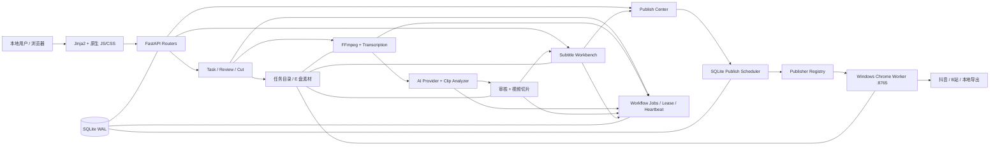

# NiuMa Studio 全项目工程体检报告

> 审计日期：2026-08-24
>
> 审计基线：`38fd60386a609b6ea85a3eb511b83cb296f4d2a1`
>
> 审计分支：`docs/project-engineering-audit`
>
> 方法：Codemap 独立模块审计 + Code Overhaul 全量工程 Review + SonarQube Community Build 26.8 实扫
>
> 边界：本轮只审计、运行隔离测试并生成文档/审计配置；没有修改生产业务代码、数据库 Schema 或真实发布流程。

## 0. P0 整改后增量状态（2026-08-24）

> 本节记录审计后的已验证整改，不改写下方原始审计快照。P1 尚未完成，因此项目成熟度暂不提前改判为“稳定 V1”。

| P0 项目 | 结果 | 验证证据 |
| --- | --- | --- |
| 测试误连活动库 | 已封口 | Pytest 无条件使用进程级临时 sandbox；整表清理二次校验路径。故意传入活动 `DATABASE_PATH` 后全量 `512 passed`，测试路径仍在 sandbox。 |
| 17 条 SQLite 外键异常 | 已修复 | 补充 8 个 `is_active=0`、无媒体路径的 tombstone；发布、字幕和 28 条 `NEED_REVIEW` 未减少；活动库 `quick_check=ok`、`foreign_key_check=0`。 |
| 文件删除无法随数据库回滚 | 已封口 | 同卷隔离暂存 + manifest；第二个目录移动失败和数据库提交失败均恢复原目录；最终清理失败返回 `cleanup_pending` 并保留恢复证据。 |
| SQLite 备份依赖 WAL/SHM | 已封口 | 三类 Online Backup 均转换为 `journal_mode=DELETE`，回归测试确认不生成配套 sidecar。 |

Codemap 独立增量复评只上调受本轮实际影响的模块：`Media & Storage 69→73`、`Task Review & Cut 61→65`、`SQLite Persistence 63→71`；其余模块保持原分。仍未解决的高风险包括媒体读取/任务目录路径边界、任务状态跳跃、切片半提交、Job/Publish fencing、Secret 返回和恢复门禁，因此下方 `59/100 · 可用 V1` 仍作为完整审计基线，待 P1 全部验收后再统一重算总健康度。

## 0.1 P1A 边界整改状态（2026-08-24）

| P1A 项目 | 结果 | 验证证据 |
| --- | --- | --- |
| 任务目录越界 | 已封口 | 统一拒绝绝对路径、盘符、`..` 和符号链接逃逸；核心创建/读取/产物路径均受 `TASKS_DIR` 约束。 |
| 同名任务目录竞态 | 已封口 | 新任务使用原子 `mkdir(exist_ok=False)` 预占；并发回归验证同名请求得到不同目录。 |
| 媒体任意文件响应 | 已封口 | 切片、字幕成片、封面分别绑定当前任务受控子目录；任务外路径和 symlink 越界均返回 404；白名单外部原片保持兼容。 |
| 进程树假终止 | 已封口 | Windows `taskkill` 检查退出码并等待退出；失败、超时或无法确认时显式报错。 |
| 全量回归 | 通过 | 边界专项 `52 passed`，完整测试 `533 passed`，Ruff、Compileall、差异检查通过。 |

Codemap 复评后 `Media & Storage` 为 **84/B**。`API & Runtime` 仍为 **58/D**、`Task Review & Cut` 为 **60/C**；后两者的低分来自尚未整改的 Secret 读取、状态跳跃、切片半提交和 FFprobe 超时，并非本轮路径改动回归。因此项目仍暂定“可用 V1”，待 Job/Publish fencing、状态原子性和本地安全门禁完成后再统一改判。

## 0.2 P1B.1 Workflow Job fencing 状态（2026-08-24）

| P1B.1 项目 | 结果 | 验证证据 |
| --- | --- | --- |
| Claim 代际 | 已封口 | `workflow_jobs.lease_token` 每次领取重新生成，不能用复用的 worker 名称冒充新 attempt。 |
| 旧 Worker 写回 | 已封口 | progress、checkpoint、heartbeat、completed、failed、cancelled、release 均要求当前 `running + owner + token`；旧 token 回归测试全部被拒。 |
| 子进程启动/退出竞态 | 已封口 | `already_claimed` 在业务副作用前验证未过期租约；父进程只处理自己捕获的 token，换代后终止旧子进程且不写失败终态。 |
| 转写/字幕从属副作用 | 已封口 | 转写分块 checkpoint 与最终 Markdown 写入前复核 token；字幕 cleanup 在同一写锁内核对 token、更新从属记录并删除精确临时文件。 |
| 最大尝试次数 | 已封口 | 有效租约即使达到上限也保持运行；只有 queued 或租约已过期的 running job 才会失败。 |
| 回归验证 | 通过 | P1B.1 定向 `92 passed`，完整测试 `546 passed`，Ruff、Compileall、差异检查通过。 |

本轮尚未在活动库执行加列迁移，也未进行正式服务重启；这是为了避免 P1B.2 尚未完成时反复触碰运行环境。Publish Scheduler/Windows Worker 仍缺 `execution_id` 写回 fencing 与重复 execution 幂等，所以项目成熟度继续保持“可用 V1”，不能只凭 Workflow Job 一侧完成就提前改判为“稳定 V1”。

## 0.3 P1B.2 Publish execution fencing 状态（2026-08-24）

| P1B.2 项目 | 结果 | 验证证据 |
| --- | --- | --- |
| 发布写回代际 | 已封口 | Provider 结果、阶段、成功、导出、失败、人工复核和安全重排队全部要求当前 `PUBLISHING + execution_id`；旧执行写回及同事务事件会回滚。 |
| Worker 重复执行 | 已封口 | 同一 execution 只有身份匹配的完整终态才重放；执行与账号使用进程内互斥和 Windows 跨进程独占锁。同一 job 的旧 execution 进入上传后，新 execution 会被持久化 journal 证据阻断。 |
| 网络不确定性 | 已封口 | 超时/连接重置后先查询 execution；锁仍活跃时保持 `PUBLISHING`，只有确认停在上传前且锁已释放才安全重试，避免盲目重复投稿。 |
| 并发修复、编辑与排期 | 已封口 | retry/repair 在 `BEGIN IMMEDIATE` 中复核源状态和活跃替代任务；发送内容、目标、AI 文案回写和排期更新均校验原状态与 `updated_at`，不能覆盖已领取或并发编辑的任务。 |
| 输入、日志与停机 | 已封口 | Worker 标识、浏览器/导出路径、人工发布 URL、风险 JSON 与敏感字段均收紧；本地发布包完整暂存后原子切换；应用保存 Scheduler Task 并在关闭时停止新扫描、等待当前轮结束。 |
| 回归验证 | 通过 | 发布定向 `144 passed`，完整测试 `610 passed`；Ruff、Compileall、差异检查全部通过，未调用真实平台。 |

P1B.1 与 P1B.2 已把“旧 Worker/旧发布 execution 覆盖新执行”和“网络不确定时盲目重试”这两类重复副作用边界封住。不过任务主状态仍允许跳跃、切片记录仍可能部分提交，Secret 读取与本地管理员接口也尚未完成收口；因此当前仍维持“可用 V1”，待 P1.3～P1.5 验收后再统一重算健康度并判断是否达到“稳定 V1”。

Codemap 独立复评结果：`Publish Scheduler 62→71（C）`、`Publishers & Worker 62→76（B）`；`Publish Center` 因 4750 行 God Service、原始 Secret 响应和旧 API Provider 风险仍维持 `52（D）`。复评未发现 Scheduler/Worker 新的 HIGH 问题；Worker 尚保留“升级前无 identity/损坏 journal 无法归属 job”的兼容边界，不能据此对历史不确定任务自动重投。

## 0.4 P1.3a 任务状态与切片原子性状态（2026-08-24）

| P1.3a 项目 | 结果 | 验证证据 |
| --- | --- | --- |
| 对外任务状态跳跃 | 已封口 | `PATCH /status` 使用显式允许转换表和同事务条件更新；空任务直接标记完成返回 409，已删除任务拒绝任何后续状态写入。 |
| 取消后的明确终态 | 已封口 | 自动 Job 请求取消时任务进入 `CANCELLED`；流水线在步骤前、步骤后和 READY 前复核取消，不再把取消映射为失败或继续完成。 |
| Task/Job 执行代际 | 已封口 | Task 步骤、切片提交和 READY 写回均校验当前 owner、token、未过期 lease 与取消标记；锁等待跨过租约时旧执行写回被拒。 |
| 取消恢复与发布清理 | 已封口 | 公开取消会同步停止活跃自动 Job；子进程退出或租约过期可收敛为 cancelled；只清理本 workflow_job_id 关联且尚未发布的任务。 |
| `READY_TO_PUBLISH` 瞬态 | 已封口 | 流水线成功后稳定保留 `READY_TO_PUBLISH`，Job 可以完成，但任务继续表示“等待人工确认发布”。 |
| 切片半提交 | 已封口 | 一个批次的全部 output clip、旧 active 停用和新 active 激活在同一 `BEGIN IMMEDIATE` 事务提交；第二条插入失败时整批回滚。 |
| 切片并发覆盖 | 已封口 | run number 在写锁内分配；每个 run 使用独立输出目录；较老 run 最后完成时不能覆盖任意已完成的较新 run。 |
| Task 终态 CAS | 已封口 | cut_run 创建与 `cutting` 同事务；切片终态只从当前 `cutting` 写入，其他流程刚更新的状态不会被晚到批次覆盖。 |
| 失败证据遮蔽 | 已封口 | summary 写入异常降级为日志和空路径，原始失败/取消状态与错误保持不变。 |
| 隔离回归 | 通过 | 完整测试 `637 passed`，Ruff 与 Python Compileall 通过；未调用真实 AI、FFmpeg、Chrome 或平台投稿。 |

本轮没有增加或迁移数据库列，也没有触碰活动数据、真实 AI 或真实投稿。Codemap 增量复评为 `Task Review & Cut 78/B`、`Pipeline & Job Queue 72/C`、`API & Runtime 48/D`、`SQLite Persistence 64/C`。后两项分数下降不是本轮状态修复回归，而是独立复评把原始 Secret 读取、可选鉴权、同步重任务阻塞 async 路由、唯一索引重建失败静默吞掉和无版本迁移重新按实际风险计分。P1.3a 解决的是“状态与切片提交能否可信”这一层；自动流水线的跨进程 step checkpoint、数据库迁移 fail-open、FFprobe/第三方错误边界和 Secret/本地管理员门禁仍按后续独立轮次处理。因此项目继续维持“可用 V1”，不能在剩余 P1 门禁完成前提前宣称“稳定 V1”。

## 1. Executive Summary

### 结论

当前项目健康度为 **59 / 100**，成熟度属于 **可用 V1**。

它已经明显超过 Demo：真实的素材接入、转写、AI 选片、人工审核、切片、字幕审核、内容准备、排期和 Windows Chrome Worker 发布链路都存在；当前本机的 FastAPI 服务和发布 Worker 也都在 `127.0.0.1` 正常监听并返回健康状态。500 项隔离测试全部通过，Ruff、Python 编译、前端 JavaScript 语法、PowerShell 脚本解析和 Docker Compose 配置检查也通过。

但它还不能称为“稳定 V1”。原因不是页面不好看或代码格式不统一，而是几个关键失败边界尚未封口：测试数据库隔离可被外部环境变量绕过，活动 SQLite 库已经存在 17 条外键不一致，长任务租约缺少 fencing，文件删除与数据库事务无法原子回滚，发布/AI 配置读取接口可能返回原始密钥，路径边界、状态转移和部分成功恢复仍较依赖调用顺序。

### 这个项目为什么现在能够运行

1. **运行模型简单且适合个人本地工具。** FastAPI、SQLite、文件系统、FFmpeg 和后台 Job 均在一台 Windows 主机上，只有真实发布被明确隔离到 Chrome Worker；没有不必要的微服务、Kafka、Kubernetes、CQRS 或 Event Sourcing。
2. **有一条真实闭环。** 系统不是展示型壳子；任务可从素材一路走到可发布视频和排期记录。
3. **已经有可靠性骨架。** SQLite 启用了 WAL、外键和 busy timeout；长任务有持久化 Job、lease、heartbeat、checkpoint；切片/字幕有版本记录；发布不确定时会进入 `NEED_REVIEW`，不会把“可能成功”伪装成确定成功。
4. **文件产物帮助恢复。** 音频、转写、分析、切片、字幕、封面和发布包分目录保存，许多步骤可以从已有产物继续。
5. **测试数量和工程脚本已经形成保护网。** 500 项测试本轮全过，CI 还覆盖 Windows/Docker smoke 的入口。

### 哪些部分可靠，哪些部分只是尚未暴露问题

| 判断 | 代表区域 | 依据 |
| --- | --- | --- |
| 相对可靠 | SQLite WAL、基础 Job 去重、发布任务条件抢占、上传失败清理、发布后不确定状态 | 有明确事务/状态、现有测试和代码证据 |
| 有条件可靠 | 字幕 revision、视频版本、AI 分析、转写 checkpoint、自动流水线 | 正常顺序可用，但并发、重启、旧 Worker、部分提交时边界不完整 |
| 高风险侥幸 | 测试库隔离、现有外键一致性、原始密钥读取、路径解析、删除事务、租约 fencing | 已发现可复现的代码路径或真实数据证据，不是代码风格问题 |

### 审计限制

- 本轮没有调用真实 AI Provider、没有产生计费请求、没有真实投稿抖音/B站，也没有绕过登录、验证码或平台风控。
- 没有执行 Docker 镜像重建；已验证三组 Compose 配置合法。
- 没有运行完整真实素材 E2E，因此“500 tests passed”不能替代一次真实长视频和真实账号验收。
- 项目未安装 Coverage 工具，也没有生成 `coverage.xml`。SonarQube 的 0% 是“没有覆盖率输入”，不是测试实际覆盖率为零。
- 依赖过期查询遇到 PyPI SSL EOF，未得到可靠的最新版本清单；`pip check` 已通过。

## 2. 项目架构图

### 2.1 运行拓扑



### 2.2 核心模块与职责

| 模块 | 职责 | 关键依赖 | Codemap 判断 |
| --- | --- | --- | --- |
| Frontend UI | 任务、审核、字幕、发送中心界面 | API Runtime | 大脚本/God Component，存在鉴权绕行和 `innerHTML` 风险 |
| API Runtime | 启动、配置、路由、健康检查 | 几乎全部业务模块 | 本地单机适配合理，但鉴权、状态边界和同步长任务混杂 |
| Media & Storage | 任务目录、上传、路径、FFmpeg 进程 | Persistence | 正常路径完整，路径安全、非原子命名和删除回滚有缺口 |
| Transcription | 音频提取、本地/火山转写、分块、checkpoint | Media、AI config | 职责过宽；旧转写复用、取消传播和并发元数据存在风险 |
| AI Selection | Provider、Prompt、解析、三种选片 profile | Transcription、Persistence | 宽松解析提升可用性，但会掩盖部分窗口失败和重复调用成本 |
| Task / Review / Cut | 状态、候选审核、切片版本、发送中心同步 | AI、Media、Publish | 核心 God Service；状态跳跃、半提交和查询口径重复 |
| Subtitle | track/revision/cue、AI 建议、渲染、交付门禁 | Cut、FFmpeg、Publish | 设计方向正确，但批量批准和并发激活不是整体原子 |
| Pipeline & Queue | 自动流程、持久化 Job、子进程、lease | 所有处理模块 | 有恢复骨架，缺 owner fencing 与 step 级副作用 checkpoint |
| Publish Center | 文案、封面、账号、草稿、历史、兼容发布 | AI、Cut、Scheduler | 后端最大热点，密钥 DTO 和历史兼容边界是主要风险 |
| Publish Scheduler | 排期、抢占、重试、恢复、人工复核 | Publisher、Worker、DB | 状态策略成熟，但后台 task 引用、全量扫描和幂等仍需加强 |
| Publisher Worker | Chrome、账号、执行日志、真实平台边界 | Scheduler、文件系统 | 正确保留人工确认，但 execution id 幂等和路径字符校验不足 |
| Persistence | Schema、启动迁移、索引、备份恢复 | 全系统 | WAL/备份是优点；无版本账本、索引异常吞掉、真实库已有孤儿关系 |
| Ops & Delivery | CI、启动、备份、诊断、Docker | Runtime、Persistence | 脚本丰富，但文档历史层叠、工具版本与环境存在漂移 |

### 2.3 Codemap 模块健康评分

13 个功能模块均由独立只读子任务按同一固定量表评分：结构 20、正确性 20、可维护性 20、测试 15、性能 15、安全 10。平均分为 **62.6 / 100**；10 个 C、3 个 D，没有 A/B。

| 模块 | LoC | 耦合 | 分数 | 等级 | 核心判断 |
| --- | --: | --- | --: | :--: | --- |
| Frontend UI | 13,840 | High | 65 | C | 能支撑当前 UI，但大脚本、XSS 和鉴权请求口径需收敛 |
| API Runtime | 2,713 | Core | 63 | C | 启动简单；鉴权、状态 API 和同步长任务边界不足 |
| Media Storage | 1,300 | High | 69 | C | 正常路径完整；允许根、命名和删除原子性有风险 |
| Transcription | 1,930 | High | 58 | D | 旧结果复用、取消、并发元数据和职责过宽 |
| AI Selection | 4,420 | Core | 63 | C | 兼容强，但 partial/fallback/Secret context 风险明显 |
| Task / Review / Cut | 2,436 | Core | 61 | C | 状态跳跃、半提交、重复查询和测试隔离风险 |
| Subtitle | 2,391 | High | 70 | C | revision 设计较好；批次、并发激活和真实媒体测试不足 |
| Pipeline / Queue | 1,745 | Core | 58 | D | 缺 lease fencing、step checkpoint 和稳定 READY 状态 |
| Publish Center | 5,561 | Core | 52 | D | Secret 泄漏 + 最大 God Service + 多种隐式 partial |
| Publish Scheduler | 1,754 | Core | 62 | C | 发布安全思想正确；execution fencing、后台 Task 和恢复竞态不足 |
| Publisher Worker | 2,116 | High | 62 | C | 真实边界清楚；execution id 幂等/路径和 journal 脱敏不足 |
| Persistence | 3,023 | Core | 63 | C | WAL/备份是优点；真实 FK 违规、迁移账本和索引错误处理是核心债 |
| Ops / Delivery | 4,347 | Medium | 68 | C | CI/脚本较完整；恢复、Demo fail-open、默认含 `.env` 和文档漂移 |

Codemap 分数高于总健康度 59 分，是因为总健康度额外纳入了“活动数据库已经发生 FK 违规”和“测试误指真实库可整表删除”这两项运行态 P0 证据，而模块评分主要评价对应代码边界。

### 2.4 核心业务和状态流

```text
素材进入
  → 媒体预检 / 任务目录
  → 音频提取
  → 带时间戳转写
  → AI 分段选片
  → 人工审核候选
  → 生成并验证切片
  → 字幕草稿
  → 人工审核并烧录，或明确跳过
  → 标题 / 简介 / 话题 / 封面
  → 创建排期
  → Scheduler 抢占任务
  → Publisher Registry
  → Windows Chrome Worker
  → PUBLISHED / FAILED / NEED_REVIEW / CANCELLED
```

关键状态并不是一个统一状态机，而是四组并行状态：

- `tasks.status`：大写自动流水线状态 + 小写手动流程状态。
- `workflow_jobs.status`：`queued/running/completed/failed/cancelled`。
- `subtitle_jobs.status` 与 revision 激活状态。
- `publish_jobs.status`：`DRAFT/WAITING/SCHEDULED/PUBLISHING/PUBLISHED/EXPORTED/FAILED/NEED_REVIEW/CANCELLED`。

这解释了系统为什么能承载多步流程，也解释了恢复困难的来源：一个用户动作可能同时更新任务主状态、Job 状态、文件产物、字幕 revision 和发布草稿。

### 2.5 修改影响半径

| 修改点 | 可能被影响的下游 |
| --- | --- |
| `task_service.py` | 任务详情、候选审核、切片、字幕、发送中心同步、Dashboard |
| `publish_service.py` | 文案、封面、账号、草稿、历史、兼容 Publisher、页面上下文 |
| `database.py` | 启动、所有 Service、迁移、索引、Prompt 种子、备份恢复 |
| `job_service.py` / `job_worker.py` | 转写、切片、自动流水线、字幕以及未来 Job 类型 |
| `storage_service.py` | 上传、媒体预览、任务删除、转写、切片、发布 Worker |
| `app.js` / `publish-center.js` | 多个页面的写请求、轮询、状态呈现和本地鉴权 |

## 3. 项目健康度

| 维度 | 分数 | 依据 |
| --- | --: | --- |
| 架构合理性 | 7/10 | 单体 + SQLite + Worker 符合个人本地项目规模；没有过度设计。扣分来自 Service 直接访问 DB、动态导入和几个 God Service。 |
| 业务逻辑 | 7/10 | 真实闭环完整，发布不确定状态处理正确；扣分来自任意状态跳跃、部分成功和四套状态并行。 |
| 代码质量 | 5/10 | Ruff/编译通过；但 Sonar 479 个 Smell、聚合 Cognitive Complexity 7307，多个 1k-4k 行热点。 |
| 数据设计 | 4/10 | WAL、FK、备份存在；但真实库 17 条 FK 违规、迁移无版本账本、索引失败被吞、部分操作非原子。 |
| 稳定性 | 5/10 | Job、checkpoint、NEED_REVIEW 提供恢复骨架；lease fencing、取消、旧产物复用和文件/DB 原子性不足。 |
| 测试 | 7/10 | 500 项全过，覆盖多种核心服务；但无 Coverage 数据、真实 E2E 不完整，且存在可清空真实库的隔离风险。 |
| 安全性 | 4/10 | `.env` 被忽略、路径删除有部分保护；但原始密钥读取、默认无写鉴权、DOM XSS、路径穿越/本地文件响应构成高价值问题。 |
| 性能与资源 | 7/10 | 当前单机规模没有明确系统性瓶颈；扣分来自高频轮询、全量排期扫描、完整 PCM/大文件内存和重复 AI fallback。 |
| 可观测性 | 6/10 | 有任务日志、进度、checkpoint、Scheduler/Worker health 和 NEED_REVIEW；但 `/health` 过浅，子进程 stderr 被丢弃，静默 fallback 多。 |
| 文档与可维护性 | 7/10 | README、架构、流程、开发日志和 CI 文档丰富；但历史段落与当前行为混排，少量模块说明已过时。 |
| **总分** | **59/100** | **可用 V1：正常路径可用，异常和并发边界尚不足以称为稳定 V1。** |

## 4. SonarQube 客观指标

### 4.1 扫描信息

- Server：SonarQube Community Build `26.8.0.126808`
- Scanner：SonarScanner CLI `8.0.1.6346`（官方 Docker 镜像）
- Project key：`niuma-studio-local-audit`
- 扫描范围：`app/`、`scripts/`，测试目录为 `tests/`；vendor、图片、手工真实 Provider 脚本和缓存已排除。
- 有效代码：`38,963` ncloc。
- 分析任务：成功；服务器处理耗时约 17 秒，首次完整 Scanner 运行约 15 分 55 秒。
- 本地 Dashboard：`http://127.0.0.1:9000/dashboard?id=niuma-studio-local-audit`
- 审计环境提示：Sonar 端口只映射到 `127.0.0.1`，但默认管理员凭据仍有效；扫描用临时 Token 已在查询结束后撤销。应单独修改 Sonar 管理员密码，这不属于 NiuMa 生产代码整改。

### 4.2 指标

| 指标 | 实测 | 解读 |
| --- | ---: | --- |
| Bugs | 29 | 其中大量是 HTML 语义容器/label 规则；真正优先核对的是 Scheduler 后台 Task 引用和少数 Python 规则。 |
| Vulnerabilities | 2 | 一项是自定义临时目录安全，一项是允许人工填 `http://` 平台链接；都需上下文审查，不等于已被攻击。 |
| Security Hotspots | 0 | Sonar 未报 Hotspot，但源码 Review 仍发现密钥响应、DOM XSS、路径和可选鉴权问题。 |
| Code Smells | 479 | 主要由 FastAPI 未声明响应码 128 项、CSS 属性/兼容规则、复杂度和重复字符串构成。 |
| Duplication | 0.2% | 总体很低；局部最高是 `transcript_service.py` 3.6%、`task_query_service.py` 3.3%。 |
| Coverage | 0.0% | **无 `coverage.xml` 输入**；不能作为真实覆盖率。JUnit 已导入 500 项测试且 100% 成功。 |
| Cognitive Complexity | 7,307 | 聚合值；说明复杂度集中明显，不代表每个文件都差。 |
| Cyclomatic Complexity | 7,608 | 聚合值；需结合文件/函数热点使用。 |
| Maintainability Rating | A | 技术债比率 0.3%；规则估算对本项目偏乐观。 |
| Reliability Rating | C | 与 29 个 Bug 指标对应。 |
| Security Rating | D | 与 2 个 Vulnerability 指标对应。 |
| Technical Debt | 3,499 分钟 | 约 58 小时 19 分；这是规则修复估算，不是整改项目工期。 |
| Quality Gate | OK | 当前 Gate 返回 `conditions=[]`，因此“OK”没有实质门禁含义。 |

问题严重度总数：4 Blocker、134 Critical、316 Major、56 Minor，共 510 项。这里的严重度是 Sonar 规则严重度，不直接等同本报告的 P0/P1。

### 4.3 复杂度热点

| 文件 | ncloc | Cognitive | Cyclomatic | 判断 |
| --- | ---: | ---: | ---: | --- |
| `app/services/publish_service.py` | 4,245 | 965 | 1,001 | 全项目最大后端热点；同时承担多种领域职责。 |
| `app/static/js/publish-center.js` | 2,104 | 931 | 796 | 页面状态、轮询和事件高度集中。 |
| `app/static/js/app.js` | 2,298 | 585 | 935 | 多页面全局脚本，鉴权和错误处理口径不一。 |
| `app/services/publish_scheduler.py` | 1,340 | 295 | 281 | 调度、claim、恢复和终态集中。 |
| `app/services/subtitle_data_service.py` | 1,176 | 288 | 270 | track/revision/cue/导入导出/波形职责过宽。 |
| `app/services/transcript_service.py` | 1,187 | 280 | 251 | FFmpeg、Provider、分块、进度、解析集中。 |
| `app/services/ai/ai_clip_analyzer.py` | 760 | 267 | 211 | Prompt、解析、修复、归一化集中。 |
| `app/db/database.py` | 1,563 | 141 | 147 | 行数极大但复杂度不是首位；主要风险是迁移/一致性而非分支数。 |

Sonar 单函数最高确认项包括：

- `publish_service.py:2067`：Cognitive Complexity 68。
- `subtitle_data_service.py:950`：47。
- `auto_publish_service.py:22`：41。
- `subtitle_data_service.py:871`：41。
- `long_live_talk_analyzer.py:83`：39。
- `job_worker.py:173`：32。

### 4.4 值得修与低价值规则

值得修：

- `publish_scheduler.py:1403` 创建后台 Task 后不保存引用：属于真实生命周期风险，应和运行架构一起修。
- Cognitive Complexity 超过 30 且位于发布、Job、字幕、AI 主路径的函数：先用 characterization test 锁定行为，再小步拆分。
- 密钥、路径、状态、并发和数据一致性问题：即使 Sonar 没报，也应优先于格式/响应文档规则。
- CSS 对比度和缺少 label：影响可访问性，可在 P2/P3 独立处理。

低价值或需人工确认：

- 128 个 `python:S8415` 要求在 FastAPI `responses` 中声明每个异常码，主要改善 OpenAPI 文档，不能排在状态一致性之前。
- 大量重复“任务不存在”“BEGIN IMMEDIATE”字符串，不应为了规则分数强行抽象成全局常量。
- `publish_scheduler.py:961` 允许人工确认链接使用 HTTP：建议收紧为 HTTPS，但它不是当前最主要的系统安全风险。
- `storage_service.py:79` 的临时目录规则需要结合 Windows ACL 和实际 E 盘目录判断，不能仅凭规则就改动存储布局。
- HTML `dt/li` 容器和 label 问题应修，但不应把 29 个 Bugs 机械解释为 29 个核心业务缺陷。

Sonar 官方说明：Python Coverage 需要先由外部测试工具生成报告，并通过 `sonar.python.coverage.reportPaths` 导入；Scanner 本身不会计算覆盖率。参考 [SonarScanner CLI](https://docs.sonarsource.com/sonarqube-server/analyzing-source-code/scanners/sonarscanner) 与 [Python test coverage](https://docs.sonarsource.com/sonarqube-server/analyzing-source-code/test-coverage/python-test-coverage)。

## 5. 问题优先级

### P0：先消除数据损坏和不可逆风险

#### P0-1 测试可在错误环境下清空真实数据库

| 字段 | 内容 |
| --- | --- |
| 文件 / 位置 | `tests/conftest.py:11-14`；`tests/test_task_query_service.py:175-195` |
| 模块 | 测试体系 / Persistence |
| 来源 | Codemap + Code Overhaul 共同发现 |
| 原因 | `conftest.py` 使用 `os.environ.setdefault`，外部已有 `DATABASE_PATH` 时不会强制切换到测试库；该测试的 autouse fixture 每个用例前后无条件删除 8 张核心表。 |
| 实际影响 | 如果 pytest 继承活动库路径，真实任务、候选、Job、切片、字幕和发布索引可能被直接清空。 |
| 发生概率 | 日常 CI 低；开发者终端已设置生产 `DATABASE_PATH` 后手工跑测试时中等。 |
| 修改收益 / 成本 / 风险 | 收益极高；成本低；修改测试基础设施风险低。 |
| Blast Radius | 整个活动 SQLite 数据库。 |
| 推荐方案 | 测试启动时强制创建唯一临时目录和数据库；若路径不是 pytest 临时目录或文件名命中活动库则 fail closed；给清理 fixture 加防误删断言。 |

本轮 500 项测试使用了显式临时 `test_workflow.sqlite3`，所以此次测试没有以活动库为目标；这不降低代码本身的风险等级。

#### P0-2 活动 SQLite 已存在 17 条外键不一致

| 字段 | 内容 |
| --- | --- |
| 文件 / 位置 | 运行态 `data/workflow.sqlite3` 的只读 `PRAGMA foreign_key_check`；Schema 位于 `app/db/database.py` |
| 模块 | Persistence / Publish / Subtitle |
| 来源 | Code Overhaul + 真实数据库只读核验 |
| 原因 | 历史删除/迁移/兼容流程允许发布和字幕记录继续引用已不存在的 `output_clip`。 |
| 实际影响 | 16 条 `publish_jobs → output_clip` 和 1 条 `subtitle_jobs → output_clip` 违规；其中发布记录含 14 条 `CANCELLED`、2 条 `NEED_REVIEW`。复核、详情联查和未来约束迁移可能失败。 |
| 发生概率 | 已经发生，不是推测。 |
| 修改收益 / 成本 / 风险 | 收益极高；成本中；直接修数据风险高，必须先确定保留历史还是恢复父记录。 |
| Blast Radius | 发布历史、人工复核、字幕记录和后续 Schema 迁移。 |
| 推荐方案 | 先做 WAL-aware 备份和 dry-run 报表；逐条判定“恢复父记录 / 将引用置空 / 归档历史”；修复后要求 `foreign_key_check` 为 0，再加回归检查。 |

补充：`PRAGMA quick_check` 返回 `ok`，说明数据库文件页结构正常；“文件没坏”与“关系一致”是两件事。

#### P0-3 永久删除把文件系统操作放在数据库提交之前

| 字段 | 内容 |
| --- | --- |
| 文件 / 位置 | `app/services/task_lifecycle_service.py:299-372`；`app/services/storage_service.py:533-554` |
| 模块 | Media Storage / Task Lifecycle / Persistence |
| 来源 | Codemap + Code Overhaul 共同发现 |
| 原因 | `BEGIN IMMEDIATE` 后先执行 `shutil.rmtree()`，随后才更新数据库并 commit；SQLite rollback 无法恢复已删除目录。 |
| 实际影响 | 文件删除成功但数据库更新/提交失败时，数据库记录回滚，托管切片、字幕和发布包却已经消失。外部唯一原片通常会保留，但派生产物仍会丢失。 |
| 发生概率 | 低，但磁盘权限、SQLite 锁、异常退出时成立。 |
| 修改收益 / 成本 / 风险 | 收益高；成本中；直接改变删除顺序有兼容风险。 |
| Blast Radius | 单个任务的全部项目托管产物。 |
| 推荐方案 | 改为“两阶段可恢复删除”：先把目标移动到项目内隔离区并记录 manifest，数据库提交后再异步清理；失败时可移回。 |

### P1：核心安全、并发和恢复边界

#### P1-1 配置读取接口返回原始 Secret

| 字段 | 内容 |
| --- | --- |
| 文件 / 位置 | `app/services/publish_service.py:564-599`、`:846-956`；`app/routers/publish.py:34-76`；`app/services/ai_config_service.py:318-335`；`app/routers/settings.py:10-16` |
| 模块 | Publish Center / AI Config / API Runtime |
| 来源 | Codemap + Code Overhaul 共同发现；Sonar 未发现 |
| 原因 | `_normalize_config/_normalize_account` 从完整 DB row 开始，仅新增 masked 字段，没有移除 `client_secret/access_token/refresh_token`；AI context 也返回完整 `values`。 |
| 实际影响 | 浏览器 DOM、开发者工具、本地调用方或代理日志可读取 OAuth/API Secret。 |
| 发生概率 | 调用配置/账号接口即可触发，中高。 |
| 修改收益 / 成本 / 风险 | 收益极高；成本低；风险低，但要保证保存页面不依赖回显原值。 |
| Blast Radius | 所有 AI/ASR 配置、平台 Client Secret、全部发布账号 Token。 |
| 推荐方案 | 建立只读响应 DTO，只返回 `configured` 和 masked 值；写接口使用“空值表示不变”的专用字段；增加接口级“原始值绝不出现”测试。 |

#### P1-2 默认写鉴权关闭，部署边界依赖启动方式

| 字段 | 内容 |
| --- | --- |
| 文件 / 位置 | `app/main.py:91-106`；`app/core/config.py:80,247`；`docker-compose.yml:14-16,34` |
| 模块 | API Runtime / Ops |
| 来源 | Codemap + Code Overhaul 共同发现 |
| 原因 | 只有 `LOCAL_ADMIN_TOKEN` 非空才验证写请求；默认值为空。Docker 内 Uvicorn 监听 `0.0.0.0`，Worker Token 也可为空。 |
| 实际影响 | 如果端口被映射到局域网，其他访问者可改任务、排期、账号和配置。个人本机 `127.0.0.1` 风险较低。 |
| 发生概率 | 当前原生服务低；Docker/LAN 场景中等。 |
| 修改收益 / 成本 / 风险 | 收益高；成本低到中；风险是启动体验改变。 |
| Blast Radius | 全部写 API 与发布操作。 |
| 推荐方案 | 原生模式继续 loopback；Docker 非 loopback 时要求 Token 或明确开发开关，启动日志给出强提醒；不要引入多用户 RBAC。 |

#### P1-3 任务目录和媒体响应的允许根边界不闭合

| 字段 | 内容 |
| --- | --- |
| 文件 / 位置 | `app/services/storage_service.py:174-179,218-230,298-315,557-565`；`app/routers/media.py:58-77` |
| 模块 | Media Storage / API Runtime |
| 来源 | Codemap 独立审计 + Code Review |
| 原因 | `task_dir_name` 的 parts 未统一走安全相对路径校验；已存在媒体路径直接返回；媒体响应只检查 exists/is_file；目录名分配是查询后返回而非原子占位。 |
| 实际影响 | 构造异常目录名可能越出任务根；异常 DB 路径可能让媒体接口返回本地其他文件；并发任务可能获得同名目录并覆盖。 |
| 发生概率 | 正常 UI 低；导入旧数据、恶意本地请求或并发重试时中等。 |
| 修改收益 / 成本 / 风险 | 收益高；成本中；风险是旧路径兼容需盘点。 |
| Blast Radius | 任务素材、切片、字幕、发布 Worker 可见文件。 |
| 推荐方案 | 所有路径入口统一 `resolve + relative_to(allowed_root)`；目录名只允许受控片段；使用原子目录占位或 DB unique；为旧 `/workspace/tasks` 映射保留显式迁移层。 |

#### P1-4 Workflow Job 租约没有 fencing

| 字段 | 内容 |
| --- | --- |
| 文件 / 位置 | `app/services/job_service.py:246-279,329,400-474`；`app/services/job_worker.py:38,173-237` |
| 模块 | Pipeline & Queue |
| 来源 | Codemap + Code Overhaul 共同发现 |
| 原因 | claim 时记录 `lease_owner` 和 attempt，但 progress/checkpoint/completed/failed/cancelled 更新只按 job id；旧子进程也不核对当前 owner。 |
| 实际影响 | 租约过期并被新 Worker 接管后，旧 Worker 恢复可覆盖新 attempt 的进度、checkpoint 和终态，造成 split-brain、重复 AI/FFmpeg 或错误完成。 |
| 发生概率 | 正常短任务低；休眠、长任务、卡顿、超时和进程恢复时中等。 |
| 修改收益 / 成本 / 风险 | 收益极高；成本中；风险中，需要迁移兼容现有 Job。 |
| Blast Radius | 单个 Job 及其任务、切片、字幕、AI 调用和下游发布草稿。 |
| 推荐方案 | 使用单调递增 `attempt_token`；所有 heartbeat、checkpoint、终态更新带 `WHERE id=? AND lease_owner=? AND attempt_token=? AND status='running'`；旧 Worker 更新失败后立即停止。 |

#### P1-5 Scheduler 后台 Task 未保存引用，Worker 请求也缺少执行幂等

| 字段 | 内容 |
| --- | --- |
| 文件 / 位置 | `app/services/publish_scheduler.py:1399-1404`（Sonar `python:S7502`）；`scripts/publish_host_worker.py:262-294` |
| 模块 | Publish Scheduler / Publisher Worker |
| 来源 | SonarQube + Code Overhaul 交叉发现 |
| 原因 | `asyncio.create_task()` 返回值不保存；Worker 收到相同 `execution_id` 时不先返回已完成 journal，而是再次执行发布。 |
| 实际影响 | Scheduler task 理论上可能被过早回收；网络超时或调用重试可能重复投稿，增加账号风控风险。 |
| 发生概率 | Scheduler 回收低到中；重复请求在网络异常时中等。 |
| 修改收益 / 成本 / 风险 | 收益高；成本低到中；风险低。 |
| Blast Radius | 全部排期扫描；重复执行影响单条平台内容和账号。 |
| 推荐方案 | App lifespan 显式保存/取消 scheduler task；Worker 以 execution id 建立幂等状态机，已完成直接返回，进行中返回冲突/同一结果。 |

#### P1-6 状态可任意跳跃，切片结果可部分提交

| 字段 | 内容 |
| --- | --- |
| 文件 / 位置 | `app/services/task_lifecycle_service.py:152`；`app/routers/tasks.py:174-179,390-399`；`app/services/video_cut_workflow_service.py:18-45,248-301` |
| 模块 | Task / Review / Cut |
| 来源 | Codemap + Code Overhaul 共同发现 |
| 原因 | 状态 API 只验证枚举，不验证合法转移/前置产物；同步切片无统一 Job 去重；run number 的 MAX 与 INSERT 分离，每条 output clip 独立提交。 |
| 实际影响 | 空任务可被标记完成；重复点击可能产生并发 run；中途异常会留下部分 output clip、processing run 和已完成主状态。 |
| 发生概率 | 正常单用户低；重试、重复请求、异常写入时中等。 |
| 修改收益 / 成本 / 风险 | 收益高；成本中到高；风险中，需兼容历史状态。 |
| Blast Radius | 单任务状态、切片版本、字幕来源和发布草稿。 |
| 推荐方案 | 先建立合法转移表和 characterization tests；同步接口统一进入持久化 Job；run number 与 run 创建同事务并加 unique；整批 output clip 与 active 切换采用阶段提交。 |

#### P1-7 转写会误复用旧结果，取消也可能变成失败

| 字段 | 内容 |
| --- | --- |
| 文件 / 位置 | `app/services/transcription_checkpoint_service.py:22-70`；`app/services/transcript_service.py:260-284`；`app/services/transcript_workflow_service.py:318-396` |
| 模块 | Transcription |
| 来源 | Codemap 独立审计 + Sonar 复杂度证据 |
| 原因 | 大文件指纹只覆盖大小和首尾各 1 MiB；`transcript.md` 存在即可判完成；宽泛异常包装会吞掉取消异常类型。 |
| 实际影响 | 中部被替换的视频可能复用旧转写；强制重转失败后旧文件仍被当当前结果；用户取消显示为 failed。 |
| 发生概率 | 文件替换/重试低到中；取消路径中等。 |
| 修改收益 / 成本 / 风险 | 收益高；成本中；风险中，重新计算全量 hash 会有大文件 IO 成本。 |
| Blast Radius | 单任务转写、AI 选片、字幕和后续切片。 |
| 推荐方案 | 使用可解释的源版本标识（文件元数据 + 分块 hash/显式导入版本）；完成标记必须绑定 run；取消异常单独透传；旧结果作为历史而非隐式 current。 |

#### P1-8 AI 部分窗口失败和协议 fallback 可能产生不完整结果及重复成本

| 字段 | 内容 |
| --- | --- |
| 文件 / 位置 | `app/services/ai/ai_clip_analyzer.py:90-158`；`app/services/ai/local_model_provider.py:19-35`；`app/services/ai/variety_comedy_analyzer.py:513-528` |
| 模块 | AI Selection |
| 来源 | Codemap + Code Overhaul 共同发现 |
| 原因 | 通用 profile 只要部分窗口产生候选就返回；全局评审失败可降级；任意 `AIProviderError` 都可能触发第二协议调用。 |
| 实际影响 | 看似成功的候选只覆盖部分素材；429/认证/超时也可能重复调用，增加 Token/费用并掩盖故障。 |
| 发生概率 | 模型格式或网络波动时中等。 |
| 修改收益 / 成本 / 风险 | 收益高；成本中；风险中，需要明确不同 profile 的产品门槛。 |
| Blast Radius | 单次 AI 任务的候选质量、费用和发布时间。 |
| 推荐方案 | 为每个 profile 定义最低窗口覆盖率和 partial 状态；只对幂等且可重试错误退避；协议 fallback 仅用于明确协议不匹配；UI 展示失败窗口与费用次数。 |

#### P1-9 前端存在 DOM XSS，且部分写请求绕过统一鉴权封装

| 字段 | 内容 |
| --- | --- |
| 文件 / 位置 | `app/static/js/app.js:1-12,211,1729`；`app/static/js/publish-center.js:2152` |
| 模块 | Frontend UI / API Runtime |
| 来源 | Codemap + 手工源码 Review；Sonar 未发现 |
| 原因 | 外部消息/任务标题进入 `innerHTML`；许多写请求直接 `fetch`，没有经过注入 Bearer Token 的 `apiFetch`。 |
| 实际影响 | 用户输入或 API 消息可破坏页面/执行脚本；启用 `LOCAL_ADMIN_TOKEN` 后部分正常操作反而 401。 |
| 发生概率 | XSS 低到中；开启 Token 后鉴权失败高。 |
| 修改收益 / 成本 / 风险 | 收益高；成本低到中；风险低。 |
| Blast Radius | 任务详情、审核、字幕和发送中心页面。 |
| 推荐方案 | 动态文本统一 `textContent/createElement`；需要 HTML 的内容只接受白名单模板；所有 API 请求走同一封装并加超时/错误规范化。 |

#### P1-10 启动迁移无版本账本，唯一索引创建失败被静默吞掉

| 字段 | 内容 |
| --- | --- |
| 文件 / 位置 | `app/db/database.py:31-532,601-648,654-965` |
| 模块 | Persistence |
| 来源 | Code Overhaul + Codemap |
| 原因 | 启动时通过表/列探测执行迁移，没有 `user_version`/ledger；部分 `executescript` 会改变事务语义；活动发布唯一索引先删除再创建，所有 `sqlite3.Error` 被 `pass`。 |
| 实际影响 | 升级失败可留下半迁移；重复历史数据导致唯一索引重建失败时，应用仍启动且不告警，后续可继续产生重复活动发布任务。 |
| 发生概率 | 新库低；历史库/异常数据升级时中等。 |
| 修改收益 / 成本 / 风险 | 收益高；成本中到高；风险高，不能直接改生产 Schema。 |
| Blast Radius | 整个数据库和应用启动。 |
| 推荐方案 | 先只增加可审计 migration ledger 和 preflight；每个版本独立 backup/verify；索引失败必须阻止相关功能或显式 degraded，不能静默继续。 |

### P2：有限范围逐步偿还

| 问题 | 文件 / 模块 / 来源 | 原因与实际影响 | 概率 / Blast Radius | 收益 / 成本 / 风险 | 推荐方案 |
| --- | --- | --- | --- | --- | --- |
| 发布中心 God Service | `publish_service.py`；Codemap + Overhaul + Sonar | 文案、封面、账号、历史、兼容 Publisher 和页面上下文共处，Cognitive 965 | 修改发布功能时高；影响全部发布路径 | 高 / 高 / 中高 | 先按只读查询、Secret DTO、内容准备、Job 创建、Legacy adapter 分 4-5 轮抽取，不改外部 API。 |
| 前端 God Scripts | `app.js`、`publish-center.js`；Codemap + Sonar | 全局状态、轮询、事件和请求口径集中 | UI 改动时中；多个页面 | 中高 / 中 / 中 | 先抽统一 request/polling/store，再按页面拆文件；不引入 React/Vue。 |
| 多 Service 直接 DB | 约 20 个文件；Codemap + Overhaul | Repository 边界只在发布域局部存在，事务跨 Service 难组合 | 新功能时高；跨域 | 高 / 高 / 高 | 只为需要原子操作的聚合增加小型 Repository/Unit of Work，不做全量 ORM 重写。 |
| 字幕批量部分成功 | `subtitle_auto_workflow_service.py:87-117`；Codemap | clip 逐项批准后才建 Job，中途失败留混合状态 | 中；单任务所有字幕 | 高 / 中 / 中 | 预检全量、单事务记录批次，再由 Job 执行；保留 revision 历史。 |
| 发布排期全量扫描与 5 秒轮询 | `publish_scheduler.py:260-281`、`publish-center.js:2227`；Overhaul | 每轮读取全部 SCHEDULED，页面重复请求 jobs/accounts/health | 当前低，规模增长后确定；发布中心 | 中 / 低 / 低 | SQL 直接筛选到期 + 合适索引；前端合并状态端点或退避。 |
| 超长媒体内存峰值 | `transcript_service.py:675`、`subtitle_data_service.py:761`；Overhaul/Codemap | Base64/PCM 完整载入内存后处理 | 长视频时中；单请求/进程 | 中 / 中 / 低 | 流式上传/分块编码；波形边读边降采样。 |
| 文件输出并非统一原子替换 | 上传、切片、analysis/metadata 写入；Overhaul | 崩溃/磁盘满可留下截断文件 | 低到中；单产物 | 高 / 中 / 中 | 统一 `.part` + fsync + replace + manifest；先覆盖最关键 source/clip/analysis。 |
| 可观测性不足 | `/health`、`job_worker.py:175`、多处 silent fallback；Codemap/Overhaul | 健康只看进程，子进程 stderr 丢弃，损坏数据常被当默认值 | 故障时高；诊断全链路 | 高 / 中 / 低 | 分离 liveness/readiness；保留受控 stderr 摘要和错误码；fallback 必须记录来源。 |
| 无覆盖率和类型检查 | `requirements-dev.txt`、CI；Sonar + Operator | 有 500 测试但无 line/branch coverage，mypy/pyright/tsc 不存在 | 持续；全项目 | 中高 / 中 / 低 | 先加 coverage 数据，仅设核心模块“不得下降”；Python 类型检查从新/高风险模块渐进启用。 |
| 文档当前态与历史态混排 | `docs/TASK_FLOW.md:3-14,114`、`NEXT_STEPS.md:288-309`；Overhaul | 顶部已是字幕审核恢复，旧段仍说自动模式跳过字幕 | 新人阅读时高；运维/验收 | 中 / 低 / 低 | 保留历史但显式标“历史行为”，新增唯一 Current State 页面。 |
| 环境版本漂移 | `.venv` 与 `requirements-dev.txt`；Operator | 实际 pytest 9.0.3 / Ruff 0.15.16，声明 9.1.1 / 0.16.1 | 本机与 CI 差异时中 | 中 / 低 / 低 | 重建受控 dev venv 或在 CI/本机打印并校验工具版本。 |

### P3：低优先级与代码洁癖

| 问题 | 依据 | 处理建议 |
| --- | --- | --- |
| 128 个 FastAPI 响应码未写入 OpenAPI | Sonar `python:S8415` | API 对外稳定后按 Router 批量补，不影响 P0/P1。 |
| 重复字符串常量 | Sonar `python:S1192` | 只抽真正表达领域含义的常量；“任务不存在”不必全局设计模式化。 |
| HTML 语义容器、label、对比度 | Sonar Bugs/Web/CSS | 作为独立可访问性轮次修，不和状态/事务改动混合。 |
| 105 个文件不符合 Ruff format | `ruff format app tests --check` | 不在整改前批量格式化，避免淹没真实 diff；按触碰文件渐进格式化。 |
| Pydantic V1 `@validator` 警告 | 7 条测试警告 | 等 Pydantic 升级轮次集中处理。 |
| CSS 未定义别名与旧属性 | Codemap + Sonar CSS | 先修真实视觉失效的变量，忽略纯兼容规则。 |

## 6. 专项检查

### 6.1 数据与数据库

#### 真实库只读结果

- 文件：`data/workflow.sqlite3`，处于 WAL 模式，审计时存在活跃 `-wal/-shm`，所以没有复制、迁移或写入。
- `PRAGMA quick_check`：`ok`。
- `PRAGMA foreign_key_check`：17 条违规，详见 P0-2。
- `PRAGMA user_version`：`0`，没有可追踪的 Schema 版本号。
- 关键规模：35 tasks、232 candidates、335 output clips、589 publish jobs、837 publish events。
- `tasks.status` 同时存在大写自动状态和小写手动状态；这是代码定义的一部分，不是简单大小写脏数据，但会增加查询、迁移和恢复复杂度。

#### Schema 判断

| 检查项 | 判断 | 风险 |
| --- | --- | --- |
| Primary Key | 主要使用文本 UUID，适合本地分布式生成 | 低 |
| Foreign Key | 连接时启用 FK，但历史数据已有违规，部分 FK 无明确删除策略 | 高 |
| Unique Constraint | 有发布活动任务等局部唯一索引；重建失败会被吞 | 高 |
| Index | 关键状态/时间有部分索引；失败不可见，全量排期扫描仍存在 | 中 |
| 状态字段 | 字符串为主，无 DB CHECK；四组状态并行 | 高 |
| 时间字段 | 多为 ISO 字符串；跨午夜排期有专门逻辑 | 中 |
| 删除策略 | 任务行保留历史、托管文件删除；语义接近“隐藏并清理媒体” | 高（命名和原子性） |
| 更新策略 | 多 Service 各自连接和 commit；跨文件/跨表事务难组合 | 高 |
| 回滚策略 | 数据库可 rollback，文件系统和外部平台不可自动 rollback | 高 |
| Migration | 启动探测式迁移，部分有备份，但无统一版本账本 | 高 |

### 6.2 稳定性故障矩阵

| 场景 | 当前行为 | 恢复判断 | 主要证据 / 缺口 |
| --- | --- | --- | --- |
| API 超时 / 网络断开 | AI/发布通常转异常或失败；旧 API 发布可能无法判断平台是否已接收 | 部分可恢复 | 超时后不总是进入 `NEED_REVIEW`；重试可能重复请求 |
| 第三方 500 / 429 | 转成 Provider error，缺统一指数退避和状态码分类 | 不稳定 | 短暂故障可能直接失败；fallback 可能重复费用 |
| AI 空内容 | 多数路径判无候选/失败 | 较明确 | 某些 Provider/归一化会用默认值继续 |
| AI 错误 JSON / Markdown | 支持 fence、修复、trailing comma、`literal_eval` | 可用但过宽 | 提高兼容性，也可能把坏结果包装成合法结果 |
| 字段缺失 / null | 候选和文案大量默认值 | 部分成功 | 数据可继续流动，但质量退化可能不醒目 |
| 上传失败 | 普通异常路径会清理任务目录 | 较明确 | 进程突然退出时直接写最终路径可留截断文件 |
| 文件损坏 | 多处有 FFprobe；部分读取静默 fallback | 部分可恢复 | transcript/progress/analysis 损坏可能被当“不存在” |
| 数据库异常 | busy timeout/WAL 有帮助 | 不稳定 | 多处静默 `except sqlite3.Error`，可能走错误 fallback |
| Worker 异常退出 | lease/heartbeat 可重新领取 | 部分可恢复 | 无 fencing，旧 Worker 恢复后仍可写 |
| Task 中途失败 | 有失败状态和日志 | 部分可恢复 | step 副作用 checkpoint 不完整，summary 二次失败可遮蔽原错 |
| 重复执行 | Job 创建有基础去重，Publish claim 有条件更新 | 部分可防 | 同步切片、execution id、旧 Worker 缺幂等 |
| 程序重启 | 持久化 Job/文件产物帮助续跑 | 有条件恢复 | 进程内转写锁、取消集合和 Pipeline context 丢失 |
| 并发请求 | SQLite `BEGIN IMMEDIATE` 覆盖部分关键动作 | 不完整 | 目录命名、cut run、字幕 revision/track 存在 check-then-act 竞态 |

总体回答：**系统失败后通常能留下一个状态，但不总能保证该状态唯一、最新且与文件/外部副作用一致。** 这正是从“可用 V1”到“稳定 V1”的主要差距。

### 6.3 测试体系

| 类型 | 当前情况 | 本轮结果 | 关键缺口 |
| --- | --- | --- | --- |
| Unit Test | Provider 解析、状态 helper、规则、路径等较多 | 纳入 500 项，全过 | monkeypatch 较多，真实资源边界不足 |
| Integration Test | SQLite、WAL/FK、Job、字幕、发布调度较丰富 | 全过 | 文件 + DB + 进程崩溃的一致性不足 |
| API Test | Tasks、Publish、Settings 等有覆盖 | 全过 | Secret 不回显、Token 开启、路径越界和并发写缺口 |
| Browser / E2E | 发送中心有 Playwright，字幕多为页面/静态检查 | 环境存在时纳入；可被 `importorskip` | 无真实“上传→转写→AI→切片→字幕→发布”闭环 |
| Smoke | CI 有 Windows/Docker 入口；当前真实本机服务/Worker 健康 | 两个 health 均 `ok` | `/health` 不检查 DB/Job/Scheduler/FFmpeg；未重建 Docker 镜像 |
| Coverage | 未配置 | Sonar 显示 0%，仅代表无报告 | 无法知道核心行/分支实际覆盖 |
| Typecheck | 未配置 mypy/pyright/tsc | 工具不存在 | `Any` 和动态 dict 边界只能靠运行时测试 |

本轮实际命令结果：

- `pytest --collect-only -q`：500 项。
- 完整 pytest：`500 passed, 9 warnings`，约 90 秒；JUnit 再跑 `500 passed`。
- Ruff lint：通过。
- Ruff format check：失败，105 个文件会被重排；没有执行格式化。
- `python -m compileall -q app tests scripts`：通过。
- 导入 `app.main`：通过。
- 全部前端 JS `node --check`：通过。
- 20 个 PowerShell 脚本 Parser：通过。
- 基础/dev/demo 三种 Docker Compose 配置：通过。
- `pip check`：通过。

目前仍完全或主要依赖人工点击的核心验证：

1. 真实长视频端到端质量和耗时。
2. 火山/本地转写真实失败恢复。
3. 真实 AI Provider 的 429、超时、坏 JSON、计费重试。
4. 字幕批量烧录的真实 FFmpeg/NVENC 失败恢复。
5. Chrome 登录态、平台 UI 变化、投稿后不确定结果。
6. 程序休眠/重启、旧 Worker 复活、同 execution id 重放。

### 6.4 安全

#### 部署语境

当前设计适合 **个人本机、loopback、受信任操作者**。它不是内部多用户系统，也不具备对外 SaaS 所需的身份、授权、租户隔离、审计和限流边界。审计不建议为当前阶段引入企业级 RBAC；建议把“只允许本机”变成明确且可验证的默认条件。

| 检查项 | 结果 | 优先级 |
| --- | --- | --- |
| API Key / Secret / `.env` | 当前只跟踪 `.env.example`；`.env`、浏览器数据、DB 被忽略；但读取接口会回显原始 Secret | P1 |
| Git 历史 Secret | 文件名扫描未发现历史 `.env`/私钥/DB；内容模式命中经脱敏核验为 `data-task-*` 属性误报 | 已核验，无确认泄漏 |
| Authentication | 可选 Bearer Token，默认空 | P1（非 loopback） |
| Authorization / 用户隔离 | 无，多用户不在当前范围 | 本地可接受，SaaS 不可接受 |
| Input Validation | Pydantic/扩展名/部分路径有校验；状态、目录片段和 Worker ID 边界不足 | P1 |
| SQL Injection | 未发现高置信度用户输入直接拼 SQL；大多数参数化 | 低 |
| XSS | 两处动态 `innerHTML` 高置信度 | P1 |
| CSRF | 不使用 Cookie 会降低经典 CSRF；Token 为空时写 API 本身无认证 | 被鉴权问题覆盖 |
| 任意文件上传 | 有扩展名/预检/允许根；突然退出的原子性不足 | P2 |
| Path Traversal / 本地文件读取 | `task_dir_name` 和媒体已存在路径边界不闭合 | P1 |
| 敏感日志 / Token 日志 | Worker/Provider 整体有隐藏意图；原始响应 DTO 和 URL 错误消息仍可能泄漏 | P1/P2 |
| CORS | 没有发现对所有来源开放写请求；本地静态/媒体 GET 有专门处理 | 低 |
| Rate Limit | 无 | 本地低；对外不可接受 |

Sonar 的 2 个 Vulnerability：

1. `storage_service.py:79`：把自定义上传目录设为系统临时目录。需检查实际 Windows ACL；当前不能仅凭该规则判定目录“publicly writable”。
2. `publish_scheduler.py:961`：人工确认作品链接允许 HTTP。建议改 HTTPS，但其影响低于 Secret DTO、路径和鉴权。

Sonar 没有发现原始 Token 响应、DOM XSS 和目录拼接，说明静态扫描必须和业务 Review 组合使用。

### 6.5 性能与资源

有明确证据、值得逐步处理的性能问题：

- 发送中心打开时每 5 秒重复刷新 jobs、accounts 和 Scheduler health；后端 jobs 查询还会重复读账号/Worker 健康。
- Scheduler 每轮读取全部 `SCHEDULED` 后在 Python 解析/筛选到期时间；当前 589 条 publish jobs 尚小，未来规模增长会线性放大。
- 旧 API multipart 发布用 `read_bytes()` + `b''.join()`，大视频产生约双份内存。
- 字幕 waveform 把完整 PCM 读入内存后再降采样。
- 火山转写 chunk 完整 Base64 入内存。
- 本地模型协议 fallback 对所有 ProviderError 尝试第二协议，可能重复模型调用和 Token 消耗。
- 通用 AI 分段失败后仍可能返回部分候选；如果人工重跑整任务，会重复已成功窗口的成本。
- `publish_service.py` 批量上下文存在账号查询 N+1；本地小规模影响暂低。

没有证据支持现在引入缓存服务、分布式队列或复杂前端构建系统。先减少重复请求、修 SQL 筛选、流式处理大文件和精确 Provider 重试即可。

### 6.6 Dead Code / Legacy / Mock 清单

本轮仅列出，没有删除。

| 候选 | 证据 | 初步判断 |
| --- | --- | --- |
| `app/services/ai_clip_service.py` | 只含硬编码三条候选的 `generate_candidate_clips_placeholder`，全仓未发现调用 | fake output，优先删除候选 |
| `publish_repository.update_execution_phase()` | 全仓未发现生产调用；测试还断言 Worker 不含该旧行为 | 可能安全删除，但需再做动态调用确认 |
| `execute_opencli_send_job()` / `execute_api_publish_job()` | 仍被 compat Publisher 调用 | Legacy，不能直接删 |
| `publishers/opencli_compat.py`、`api_compat.py` | Registry 仍注册；旧任务模式可能引用 | 需数据盘点后删除 |
| `publishers/page_scripts.py` | 通过 wrapper 回调 `publish_service` 私有函数 | 丑但仍是 Worker 兼容胶水，暂不删 |
| `job_service` 的 `ai_analysis` / `publish` Job 类型 | execute_job 没有对应分支 | stub/未来预留，需确认产品方向 |
| `transcript_service.allow_fallback` / `TRANSCRIPTION_FALLBACK_PROVIDER` | 未发现 `allow_fallback=True` 生产调用 | 需要确认后删除 |
| `/workspace/tasks` 旧路径映射 | `storage_service.py:298-340` | Docker/历史数据兼容，暂不删 |
| 旧 AI_REMOTE 配置别名 | 运行时仍同步新旧字段 | 需配置迁移后删除 |
| 旧小写/新大写发布状态与字段别名 | DB 和服务并存 | 必须先迁移真实历史数据 |
| 历史文档段落 | 与当前字幕行为并存 | 应归档/标历史，不是直接删除证据 |

### 6.7 当前已有且应保留的工程资产

- SQLite WAL、busy timeout、连接级 FK。
- `create_or_get_active_job()` 的事务性基础去重。
- 发布 Scheduler 的条件 claim 和上传后 `NEED_REVIEW` 原则。
- Windows Worker 的 execution journal 和账号锁。
- 长直播 checkpoint 和 90% 覆盖率门槛。
- 字幕 track/revision/cue 历史和发布前验证门禁。
- FFmpeg/FFprobe、备份恢复、启动健康检查脚本。
- CI 的 Windows + Docker smoke 入口、敏感文件检查和独立 demo DB。

## 7. 技术债 Top 10

排序依据不是“代码难看”，而是 **发生风险 × 业务影响 × 未来维护成本 × 修复收益**。

| 排名 | 技术债 | 风险 / 影响 | 未来成本 | 修复收益 | 为什么排在这里 |
| --: | --- | --- | --- | --- | --- |
| 1 | 测试数据库 fail-open，可执行整表删除 | 极高 / 全库 | 每次手工测试都可能触发 | 极高 | 修改成本最低，却能消除最不可接受的数据损坏入口。 |
| 2 | 活动库已有 17 条 FK 违规，迁移无版本账本 | 已发生 / 发布与字幕历史 | 每次迁移都会放大 | 极高 | 先恢复数据可信度，其他重构才有可靠基线。 |
| 3 | 原始 API/OAuth Secret 经读取接口回显 | 高 / 全部凭据 | 接口越多越难清理 | 极高 | 本地项目也不应把原始 Token 发到浏览器。 |
| 4 | Workflow/Publish execution 缺 lease fencing | 高 / 重复执行与错终态 | 新 Job 类型会复制缺陷 | 极高 | 是“平时能跑、异常顺序就错”的典型核心债。 |
| 5 | 存储路径允许根、目录名和媒体响应边界不统一 | 高 / 本地文件与任务产物 | 旧路径越多越难迁移 | 高 | 安全和数据覆盖同时受影响。 |
| 6 | 永久删除的文件系统与 DB 事务不可回滚 | 低概率高损失 / 单任务全部产物 | 删除类型增加会放大 | 高 | 必须在继续扩展清理功能前改成可恢复两阶段。 |
| 7 | 状态任意跳跃、切片/字幕批量结果可部分提交 | 中高 / 下游全链路 | 状态越多越难收敛 | 高 | 当前四套状态的核心一致性问题。 |
| 8 | 转写旧产物复用、取消传播和并发元数据不可靠 | 中高 / AI 与字幕输入 | 长视频越多越贵 | 高 | 错转写会悄悄污染所有下游结果。 |
| 9 | AI 部分窗口/fallback 缺明确成本和质量门槛 | 中 / 质量与费用 | Provider/profile 增加会放大 | 高 | 需要产品语义，不是简单加 retry。 |
| 10 | `publish_service.py` 与前端大脚本成为发布域 God Components | 中 / 发布全域 | 每个新功能持续提高回归成本 | 高 | 应在安全和状态边界稳定后渐进拆分，不能先大重构。 |

## 8. 删除候选清单

### 可以安全删除（仍应放在独立清理 PR 中验证）

| 候选 | 依据 | 删除前最低验证 |
| --- | --- | --- |
| `app/services/ai_clip_service.py` | 仅返回三条硬编码 fake candidates，全仓静态引用为 0；架构文档对它的描述已过时 | 再做动态导入搜索；跑 AI/自动流水线测试；同步修 `docs/ARCHITECTURE.md` |
| `publish_repository.update_execution_phase()` | 全仓未发现生产调用，测试明确要求 Worker 不依赖它 | 跑 Publisher/Scheduler 全套测试 |
| `publish_service.py` 中被后续定义覆盖的首组 `STATUS_LABELS/STATUS_TONES` | 同文件后续重新定义，前值不会生效 | 用导入后对象断言 + 发布历史/页面测试确认 |

“可以安全删除”是静态审计结论，不代表本轮已删除；本轮没有改动这些文件。

### 需要确认后删除

| 候选 | 需要确认什么 |
| --- | --- |
| `opencli_compat.py`、`api_compat.py` 及两个 legacy execute 函数 | 真实 DB 是否仍有对应 `publish_mode/provider` 记录；是否还需要历史重试 |
| `job_service` 的 `ai_analysis` / `publish` 类型 | 是未来计划还是未完成 stub；若保留必须接线，若无计划应删定义和 UI |
| `TRANSCRIPTION_FALLBACK_PROVIDER` / `allow_fallback` | 是否有项目外脚本或用户工作流依赖 |
| AI_REMOTE_* 旧配置别名 | 活动 `.env` 和持久化设置是否仍使用旧名；不得读取/输出 Secret 值，只盘点键名 |
| `/workspace/tasks` 旧路径映射 | Docker 历史记录是否仍保存该路径 |
| task_service 末尾查询兼容 wrappers | 所有 Router/模板是否已迁到 task_query_service |
| 历史文档中旧流程段落 | 先决定迁入 `docs/history/` 还是加“历史行为”标记 |

### 暂时不要删除

| 代码 / 数据 | 原因 |
| --- | --- |
| B站后端 Publisher、历史记录和字段 | 当前前端主推抖音不等于后端历史可删除；删除前必须迁移真实记录。 |
| `manual_export` | 是真实发布不可用时的安全、可验证降级，不是 fake success。 |
| `page_scripts.py` 与浏览器兼容胶水 | 虽然耦合丑，但真实 Worker 当前仍依赖。 |
| `NEED_REVIEW`、execution journal、Worker artifacts | 它们是防止不确定结果被误判成功的核心安全证据。 |
| `database_backup_service.py`、WAL-aware backup/runtime wrapper | 这是数据库整改前的安全基础；应整理而非先删。 |
| 旧数据库列/状态别名 | 真实库已有历史数据，必须迁移并验收后才能删除。 |
| 活动 `.db-wal/.db-shm` | 表示存在写连接，不能当缓存随意删除。 |

## 9. 暂时不要动的地方

1. **不要把 SQLite 改成 PostgreSQL，也不要引入 ORM 大迁移。** 当前规模下 SQLite 合理，问题是约束、迁移账本和事务边界，而不是数据库品牌。
2. **不要把单体拆微服务。** 当前故障多来自跨状态/跨文件原子性；拆服务只会增加网络和分布式一致性问题。
3. **不要为了 Sonar A 评级先拆 `database.py`。** 先修真实数据和 migration ledger，再按版本迁移小步拆分。
4. **不要改掉 `NEED_REVIEW` 和上传后不自动重试策略。** 这是平台发布最重要的防重复边界之一。
5. **不要重写已经工作的字幕 revision 模型。** 它保留历史、可审核、可回滚；只需加强批量事务和 owner/version 条件。
6. **不要直接统一删除大写/小写状态。** 真实数据、查询和 UI 均依赖；先建立映射、数据统计和迁移测试。
7. **不要先批量格式化 105 个文件。** 大 diff 会掩盖 P0/P1 修复，也增加合并冲突。
8. **不要先清理所有 Legacy Publisher。** 必须先盘点 DB 模式和历史任务，确保没有可恢复任务被切断。
9. **不要大改 E 盘任务目录布局。** 文件路径已被数据库、字幕、发布包和 Worker 引用；路径安全可以在保持布局的前提下修。
10. **不要因为 `styles.css/app.js` 很大就先重写前端。** 先修 `innerHTML`、统一 API 请求和轮询，再按页面渐进拆分；不引入 React/Vue。

## 10. Impact × Effort 矩阵

| | 低成本 | 中成本 | 高成本 |
| --- | --- | --- | --- |
| **高影响** | 测试库 fail-closed；Secret DTO；保存 scheduler task；URL hostname 校验；统一前端鉴权 | 路径允许根；lease fencing；AI partial 门槛；转写 run 绑定 | FK 历史修复；状态/切片原子化；migration ledger |
| **中影响** | CSS 变量；文档当前态；工具版本校验 | 覆盖率/核心 E2E；日志和 readiness；轮询/SQL due | `publish_service` 渐进拆分；DB 访问边界收敛 |
| **低影响** | OpenAPI responses；重复字符串；小型命名 | 可访问性批次；格式化触碰文件 | 全前端重写、ORM、微服务——当前不做 |

## 11. 整改路线图

每一轮都限制范围、可单独测试、可单独回滚。**不要合并为“全面重构”。**

| 轮次 | 有限范围 | 独立验收 | 回滚方式 |
| --- | --- | --- | --- |
| P0.1 测试数据库保护 | 仅 `tests/conftest.py` 和危险 fixture；强制临时库、危险路径拒绝 | 在故意设置活动库路径时 pytest 应在收集前拒绝；正常临时库 500 项全过 | 回滚测试基础设施提交，无生产数据迁移 |
| P0.2 数据一致性盘点与修复 | WAL-aware 备份、17 条孤儿 dry-run、逐类处理策略 | backup hash/quick_check/FK check；修复后 0 违规；应用只读页面回归 | 整库备份恢复；保留修复 manifest |
| P0.3 可恢复删除 | 单个任务删除改为隔离区 + manifest + DB commit + 延迟清理 | 模拟 DB commit 失败、文件移动失败、进程中断；均能恢复 | 把隔离目录移回；回滚代码 |
| P1.1 Secret DTO 与本地鉴权 | AI/Publish 读取 DTO；非 loopback 启动门禁；不做多用户系统 | API 响应扫描不含原值；Token on/off、原生/Docker 组合测试 | 兼容写入字段保留；回滚 API DTO 提交 |
| P1.2 路径和 Worker 标识边界 | `task_dir_name`、media FileResponse、execution/account id；不改目录布局 | traversal、绝对路径、symlink、异常 DB 路径、重复 execution 测试 | 兼容旧合法路径白名单；回滚验证层 |
| P1.3 Workflow lease fencing | 增 attempt token；所有更新带 owner/token/status；旧 worker fail closed | 两 Worker、租约过期、休眠恢复、旧终态覆盖测试 | Schema 先兼容可空列；回滚代码保留列 |
| P1.4 Publish execution 幂等与 Scheduler 生命周期 | 保存/await task；execution journal 幂等；repair 条件锁 | 同 execution 重放、旧 execution 写回、并发 repair、优雅关停 | 回滚应用层状态机，journal 数据仍兼容 |
| P1.5 Task/Cut/Subtitle 状态与批次原子性 | 先合法转移表，再切片 run 和字幕批准批次；不改 UI 主流程 | 非法跳跃拒绝、并发 run、批次中途失败、旧 active 保留 | 每项独立提交；特性开关保留旧入口短期回退 |
| P1.6 Transcription 正确性 | run/source 绑定、取消透传、损坏产物显式状态 | 大文件中部变化、旧文件、取消、进度 JSON 损坏、重启测试 | 旧 transcript 只降为历史，不删除 |
| P1.7 AI 质量与成本门禁 | profile 覆盖率、partial 状态、错误分类、有限退避 | 429/500/超时/坏 JSON/部分窗口/重复调用次数测试 | 配置化门槛，可回滚到旧行为但保留日志 |
| P1.8 Migration ledger 与索引不变量 | 只为未来迁移加版本账本/preflight；当前 Schema 不大改 | 旧库升级、半迁移、重复数据、索引失败应明确阻断 | 每版前备份；一个 migration 一次提交 |
| P2.1 覆盖率与真实故障测试 | 加 Coverage；先锁 P0/P1 核心模块，不追漂亮总百分比 | CI 产 `coverage.xml`，Sonar 能导入；核心门槛不得下降 | 移除阈值不影响生产代码 |
| P2.2 可观测性 | readiness、Job/Worker 错误码、受控 stderr、fallback 日志 | DB/Worker/FFmpeg 故障时状态明确且不泄密 | 回滚观测层，无数据迁移 |
| P2.3 Publish Service 渐进拆分 | 先 Secret DTO/query，再内容准备，再 job，最后 legacy adapter | 每轮 API contract、发布状态机和浏览器测试全过 | 一轮一个提交，旧 facade 保持接口 |
| P2.4 原生前端渐进拆分 | 先 request + escape，再 polling，再按页面模块化 | Token 开启、XSS、轮询、字幕/发送中心 Playwright | 保留原函数 facade，不换框架 |
| P2.5 Dead/Legacy 清理 | 每次只处理一个已确认无引用候选 | `rg`/动态导入盘点 + 全测试 + 历史 DB 模式统计 | 单候选单提交，直接 revert |
| P3.1 文档和格式 | Current State 文档、历史标记、触碰文件格式化、可访问性 | 文档链接、Ruff、页面 smoke | 不与业务改动混合，单独回滚 |

## 12. 最终判断

### 当前为什么能跑

因为项目选择了合适的本地单体架构，并且已经建立了 SQLite WAL、持久化 Job、文件产物、版本化字幕/切片和发布人工复核这些实用保护；500 项测试也覆盖了大量正常路径和若干失败路径。

### 哪些是可靠的

单机正常顺序下的核心业务闭环、基础 Job 去重、发布 claim、上传失败清理、字幕 revision 历史、发布不确定状态和 Windows Worker 隔离是可信资产。

### 哪些只是侥幸没出问题

测试是否永远指向测试库、旧 Worker 是否永远不会复活、目录名是否永远来自正常 UI、文件删除后数据库是否永远能提交、AI 是否总有足够窗口成功、配置接口是否只被可信浏览器访问——这些都依赖环境或顺序，并未被代码强制保证。

### 应该先改什么

先保护测试和真实数据，再封 Secret/路径/lease/删除/状态边界；随后补覆盖率和故障可观测性；最后才拆 God Service、清 Legacy 和整理格式。

### 哪些不要碰

不要换架构、不要改掉人工复核、不要先删除历史兼容、不要直接迁移状态和目录、不要用大规模格式化或前端重写掩盖真正风险。

本报告完成后应停止审计阶段。下一步应由用户先确认 P0/P1 顺序，再逐轮整改。
