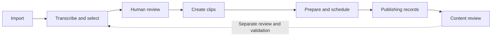

<div align="center">


# NiuMa Studio

**From long videos to moments worth sharing.**

Transcribe, find highlights with AI, review clips, prepare content and schedule on your Windows PC.

[简体中文](README.md) · [Quick start](#quick-start) · [Documentation](docs/README.md) · [Changelog](CHANGELOG.md)

[](https://github.com/damingishere-coder/Ai-Clip-Workflow/actions/workflows/ci.yml)
[](CHANGELOG.md)


[](LICENSE)

</div>

## Development status

**2.6.0 Local Content Production Workspace** includes studio variety comedy, interviews, knowledge/opinion, long live talk, and general. Task creation supports Profile, Prompt, and AI Provider selection. Interview and knowledge profiles use separate prompts and scoring dimensions and are marked **trial**, pending real-content quality validation during normal use. General and long live talk retain their legacy default prompt, which users can override.

Content Review saves human-review and official-performance reports with sample sizes, time ranges, missing data, and version evidence. Human-authored Challenger drafts can create explicit trial tasks; formal experiments require a sufficient official baseline. Recording an experiment conclusion does not activate a strategy: enabling or reverting the production Prompt requires a separate confirmation. Existing tasks keep their frozen settings.

Optional visual assistance is **trial and off by default**. Only recalled candidate ranges are sampled, then verified with the existing Codex provider. Ordinary visual failures fall back to text/audio; analysis history retains timestamps, model identity, limitations and failures. Images may be pinned or expire while structured evidence remains. Human review remains required.

Under the user's updated acceptance policy, passing engineering, compatibility, and runtime checks permits continued development; real-content quality is evaluated during normal use. Users are not required to supply dedicated samples or complete a blind review first. Human clip review, scheduling, and publication boundaries remain. The source library supports local-folder previews and idempotent batches. Optional automatic production runs serially through transcription, analysis and pre-cutting, then pauses in Review Inbox. Human confirmation of the current clips and subtitle choice is required before explicit content preparation and scheduling. Individual-file uploads remain available. See the actual release/deployment [status](PROJECT_STATUS.md), [implementation ledger](docs/CONTENT_PROFILE_ROLLOUT.md), and [acceptance requirements](docs/CONTENT_PROFILE_ACCEPTANCE.md).

## One workspace for the whole process

| Find the content | Produce the clip | Learn from results |
| --- | --- | --- |
| Import a local video or a confirmed folder batch | Review transcripts and adjust cut points | Import Douyin metrics and confirm attribution |
| Local faster-whisper transcription | FFmpeg clips and a separate subtitle workspace | Weekly reviews and Prompt version comparisons |
| AI candidates and structured scoring | Titles, topics, cover frames and scheduling | Read review suggestions and preview adaptive schedules |



**Local-first, with configurable processing.** Media, SQLite data and browser sessions stay on your PC. Remote transcription or AI services receive the audio or text required for that operation. AI supports a controlled Codex CLI process, with OpenAI-compatible / DeepSeek and Ollama compatibility options. Each requires its own runtime or account configuration; a local CLI does not imply local model inference.

## Preview

These existing public screenshots are sanitized and illustrate the workflow. Individual controls may differ in the current version.


<details>
<summary><strong>Task details, clip review and publishing center</strong></summary>


</details>

## Quick start

### Native Windows setup

Install **Windows 10 / 11, Python 3.12+, Git and FFmpeg / FFprobe**, available from PowerShell. Real publishing also requires Google Chrome.

```powershell
git clone https://github.com/damingishere-coder/Ai-Clip-Workflow.git
cd Ai-Clip-Workflow
python -m venv .venv
.\.venv\Scripts\python.exe -m pip install -r requirements.txt
.\scripts\setup.ps1
.\scripts\start_native.ps1
```

Open **[the local workspace](http://127.0.0.1:8001)**, configure transcription and AI, then use a short test video to complete import, analysis, review and local clip generation.

- Setup preserves an existing `.env` and initializes local tokens and directories on first use.
- Native startup defaults to drive E. To use another location, run `.\scripts\start_native.ps1 -StorageRoot D:\NiuMaData` with your own path.
- Offline transcription requires downloaded models. See [deployment](docs/DEPLOYMENT.md) for NVIDIA GPU setup.
- If RunDock manages the app, use its existing service rather than duplicating ports `8001` / `8765`.
- Stop a manually started instance with `.\scripts\stop_native.ps1`.

Detailed guides are currently in Chinese: [getting started](docs/PROJECT_GUIDE.md), [startup modes](docs/PORTABLE_SETUP.md), [deployment](docs/DEPLOYMENT.md).

### Isolated demo

With Docker Desktop installed and running, execute from the cloned repository:

```powershell
.\scripts\start.ps1 -Demo
```

The demo uses fictional tasks, a separate database and `manual_export` drafts. Scheduling is disabled; no API key or real platform account is required. Stop with `.\scripts\stop.ps1 -Demo`. Reset samples with `.\scripts\start.ps1 -Demo -ResetDemo`.

## Capabilities and boundaries

| Capability | Status |
| --- | --- |
| Import, transcription, AI selection, review and clipping | Implemented; selected models and services require configuration |
| AI recovery | Per-unit progress and evidence; uncertain calls require confirmation before retry |
| Content reviews, weekly summaries and adaptive scheduling | Manual report generation; suggestions are read-only and scheduling has a separate preview |
| Douyin publishing | Windows Chrome Worker; login and per-account validation required |
| Bilibili | Backend and historical compatibility retained; current UI and automatic synchronization disabled |
| Subtitles | Separate workspace; automatic workflows do not burn subtitles in |
| Multi-user cloud hosting | Not supported; designed for local single-user operation |

> [!IMPORTANT]
> Real submissions require rights to the source media, platform login, verification and content review. The project does not bypass CAPTCHA or platform controls. Uncertain publishing results require human review. Start by generating a local clip before testing publishing.

## Versions and updates

**2.3.0 consolidates the existing local runtime into `master`.** `VERSION` identifies the source version; [GitHub Releases](https://github.com/damingishere-coder/Ai-Clip-Workflow/releases) identifies published releases. Updating the version number does not replace release acceptance.

Use short-lived `codex/*` branches targeting `master`, passing checks before merging and updating the existing service. Unmerged experiments are not stable releases. See [branch maintenance](docs/BRANCHING.md).

Before updating, identify the actual runtime directory and create a backup:

```powershell
.\scripts\pre_upgrade.ps1
git status --short --branch
```

Only run `git pull --ff-only` on `master` with a clean working tree and no local-only commits. Restart the existing service using the [deployment guide](docs/DEPLOYMENT.md). Preserve local changes before switching.

## Documentation and contribution

[Current project status (Chinese)](PROJECT_STATUS.md) · [Next steps (Chinese)](NEXT_STEPS.md)


| Goal | Guide |
| --- | --- |
| Install and process a first video | [Getting started](docs/PROJECT_GUIDE.md) |
| Explore startup modes and demo | [Portable setup](docs/PORTABLE_SETUP.md) |
| Protect data and roll back | [Backup and restore](docs/BACKUP_AND_RESTORE.md) |
| Understand the implementation | [Technical reference](docs/TECHNICAL_REFERENCE.md) · [Architecture](docs/ARCHITECTURE.md) |
| Follow versions and plans | [Changelog](CHANGELOG.md) · [Roadmap](ROADMAP.md) |
| Maintain branches and releases | [Branch maintenance](docs/BRANCHING.md) · [Release checklist](docs/RELEASE_CHECKLIST.md) |
| Report an issue or contribute | [Issues](https://github.com/damingishere-coder/Ai-Clip-Workflow/issues) · [Contributing](CONTRIBUTING.md) · [Security](SECURITY.md) |

Reproducible bug reports, installation feedback, documentation improvements and tests are welcome. Do not upload private media, databases, API keys, cookies or personal information from logs.

Licensed under [MIT](LICENSE). See [third-party notices](THIRD_PARTY_NOTICES.md).
