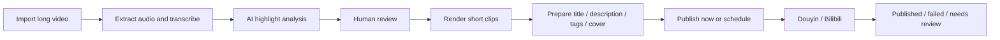

<div align="center">

# NiuMa Studio

**Turn long-form videos into reviewable, schedulable, publish-ready short clips.**

A Windows-first, local AI video highlight workspace for livestream recordings, interviews, variety shows, and other long-form media.

[中文](README.md) · [English](README.en.md) · [Quick Start](docs/PROJECT_GUIDE.md) · [Technical Reference](docs/TECHNICAL_REFERENCE.md) · [Roadmap](ROADMAP.md)


</div>

> [!IMPORTANT]
> NiuMa Studio is a local, single-user application rather than a cloud SaaS. Real publishing relies on your own platform accounts and local Chrome sessions. It does not bypass QR codes, SMS verification, CAPTCHAs, sliders, login checks, or platform risk controls.

## Why NiuMa Studio

Producing short clips from long-form video involves much more than cutting a file. The costly parts are transcription, highlight discovery, review, versioned exports, platform copy, scheduling, and reliable result tracking.

NiuMa Studio brings those steps into one local workflow:

- **AI highlight discovery** with OpenAI-compatible APIs, DeepSeek, or local Ollama models.
- **Human review** for enabling, disabling, retiming, and rewriting candidate clips.
- **Unified production** for transcription, clipping, copy, cover frames, schedules, and execution history.
- **Local-first storage** for videos, databases, API keys, and browser login state.
- **Conservative publishing** that only marks a job as published after explicit success evidence.

## Workflow



## Current capabilities

| Area | Capability | Status |
| --- | --- | --- |
| Media intake | Browser upload, local paths, NAS paths, isolated task folders | ✅ Available |
| Transcription | Volcengine remote transcription and local faster-whisper | ✅ Available |
| AI analysis | General-value mode, comedy-first mode, segmented long-video analysis | ✅ Available |
| Review and clipping | Edit candidates, save selections, generate versioned clips | ✅ Available |
| Content preparation | Titles, descriptions, tags, cover frames, accounts, visibility | ✅ Available |
| Scheduling | Batch preview, overnight windows, calendar view, timeline continuation | ✅ Available |
| Douyin / Bilibili publishing | Windows Chrome Worker with isolated account profiles | 🟡 Per-account validation required |
| Subtitle workspace | ASS / FFmpeg subtitle rendering | 🟡 Separate workflow |
| Multi-user cloud deployment | Accounts, permissions, collaboration, public hosting | ❌ Not supported |

## Quick start

### Docker Desktop (recommended)

```powershell
git clone https://github.com/damingishere-coder/Ai-Clip-Workflow.git
cd Ai-Clip-Workflow
Copy-Item .env.example .env
docker compose up -d
```

Open:

```text
http://127.0.0.1:8001
```

Health check:

```text
http://127.0.0.1:8001/health
```

Update `.env` with storage paths and AI settings that match your own Windows machine before processing media.

### Local Python

```powershell
python -m venv .venv
.\.venv\Scripts\Activate.ps1
python -m pip install --upgrade pip
pip install -r requirements.txt
Copy-Item .env.example .env
uvicorn app.main:app --reload --port 8001
```

The detailed beginner guide is currently maintained in Chinese: [docs/PROJECT_GUIDE.md](docs/PROJECT_GUIDE.md).

## First-success checklist

Before testing real publishing:

1. Open the home page and `/health` successfully.
2. Upload a short, low-risk test video.
3. Complete transcription and AI analysis.
4. Review at least one candidate and generate a clip.
5. Confirm the clip appears in the publishing workspace.
6. Preview a schedule in China Standard Time.

Only test real publishing after the Windows Worker is healthy and the target account is logged in.

## Operational boundaries

- Windows-first, local, single-user deployment with FastAPI, SQLite, and local files.
- `local_browser` is the default publishing mode; `manual_export` only exports a local package.
- Login failures, CAPTCHAs, risk controls, and uncertain outcomes become `NEED_REVIEW` instead of automatic retries.
- Platform pages change frequently, so real publishing must be validated per account and per release.
- The project does not store platform passwords or bypass platform security mechanisms.

See [Technical Reference](docs/TECHNICAL_REFERENCE.md) for architecture, job states, Scheduler and Worker details.

## Documentation

| Document | Purpose |
| --- | --- |
| [Beginner Guide](docs/PROJECT_GUIDE.md) | Setup, configuration, startup, first test, troubleshooting |
| [Technical Reference](docs/TECHNICAL_REFERENCE.md) | Architecture, storage, scheduling, publishing states, tests |
| [Roadmap](ROADMAP.md) | Planned work and explicit non-goals |
| [Contributing](CONTRIBUTING.md) | Issues, development setup, tests, pull requests |
| [Security](SECURITY.md) | API keys, cookies, local data, vulnerability reporting |
| [Changelog](CHANGELOG.md) | Public release history |

## Testing

```powershell
.\.venv\Scripts\Activate.ps1
pytest -v
```

Automated tests should use isolated data and must not publish to real platform accounts.

## Contributing

Bug reports, documentation improvements, feature proposals, and platform compatibility fixes are welcome. Please read [CONTRIBUTING.md](CONTRIBUTING.md) first.

Changes that bypass authentication, CAPTCHAs, platform safeguards, or required human confirmation are not accepted.

## License

Licensed under the [MIT License](LICENSE). Third-party dependencies and external services remain subject to their own licenses, terms, and platform policies.
