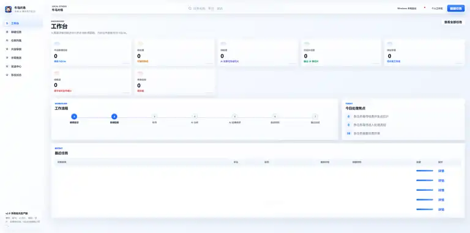
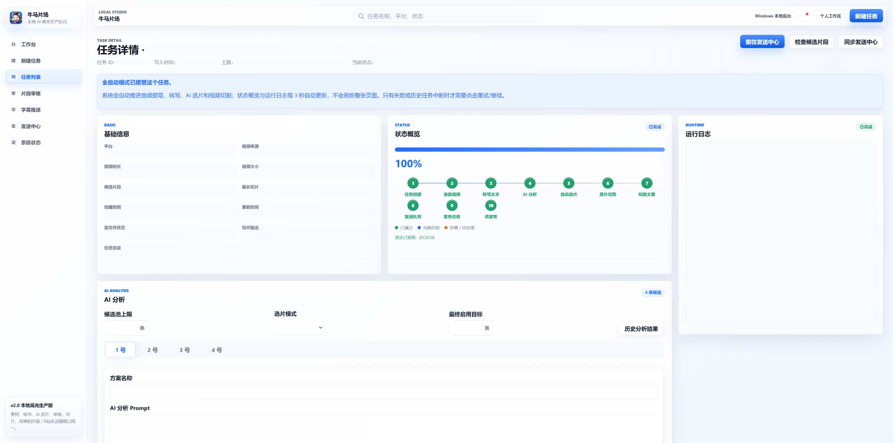
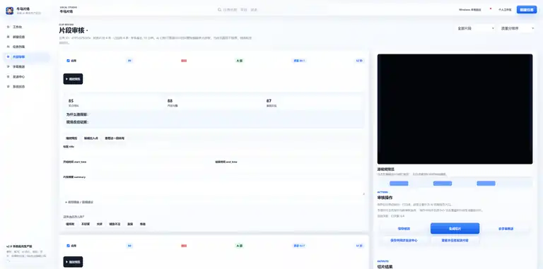
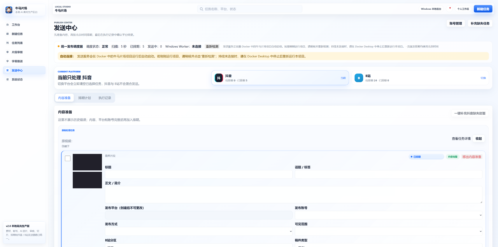
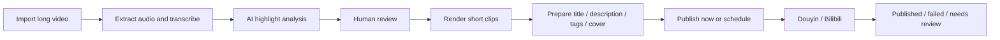

<div align="center">

# NiuMa Studio

**Turn long-form videos into reviewable, schedulable, publish-ready short clips.**

A Windows-first, local AI video highlight workspace for livestream recordings, interviews, variety shows, and other long-form media.

[中文](README.md) · [English](README.en.md) · [Quick Start](docs/PROJECT_GUIDE.md) · [Portable Setup](docs/PORTABLE_SETUP.md) · [Backup & Restore](docs/BACKUP_AND_RESTORE.md) · [Technical Reference](docs/TECHNICAL_REFERENCE.md) · [Roadmap](ROADMAP.md)


</div>

> [!IMPORTANT]
> NiuMa Studio is a local, single-user application rather than a cloud SaaS. Real publishing relies on your own platform accounts and local Chrome sessions. It does not bypass QR codes, SMS verification, CAPTCHAs, sliders, login checks, or platform risk controls.

## Product preview

> [!NOTE]
> These are sanitized screenshots from a Windows local installation. They demonstrate the interface and workflow without exposing real task content, account credentials, or personal information.

### Dashboard



### Task detail



### Clip review



### Publishing center



## Zero-configuration demo

You can inspect the complete interface without a video, API key, or platform account:

```powershell
.\scripts\start.ps1 -Demo
```

The demo uses isolated `demo-data/` and `workspace/demo/` directories. It creates fictional tasks, AI candidates, rendered demo clips, and safe `manual_export` drafts. It does not use the production database, connect real accounts, or run the publishing scheduler.

Reset the demo:

```powershell
.\scripts\start.ps1 -Demo -ResetDemo
```

## Why NiuMa Studio

Producing short clips from long-form video involves much more than cutting a file. The costly parts are transcription, highlight discovery, review, versioned exports, platform copy, scheduling, and reliable result tracking.

NiuMa Studio brings those steps into one local workflow:

- **AI highlight discovery** with OpenAI-compatible APIs, DeepSeek, or local Ollama models.
- **Human review** for enabling, disabling, retiming, and rewriting candidate clips.
- **Unified production** for transcription, clipping, copy, cover frames, schedules, and execution history.
- **Local-first storage** for videos, databases, API keys, and browser login state.
- **Conservative publishing** that only marks a job as published after explicit success evidence.

## Workflow



## Current capabilities

| Area | Capability | Status |
| --- | --- | --- |
| Media intake | Browser upload, local paths, NAS paths, isolated task folders | ✅ Available |
| Transcription | Volcengine remote transcription and local faster-whisper | ✅ Available |
| AI analysis | General-value mode, comedy-first mode, segmented long-video analysis | ✅ Available |
| Review and clipping | Edit candidates, save selections, generate versioned clips | ✅ Available |
| Content preparation | Titles, descriptions, tags, cover frames, accounts, visibility | ✅ Available |
| Scheduling | Batch preview, overnight windows, calendar view, timeline continuation | ✅ Available |
| Data protection | Verified SQLite snapshots, manifests, restore rollback, upgrade protection | ✅ Available |
| Douyin / Bilibili publishing | Windows Chrome Worker with isolated account profiles | 🟡 Per-account validation required |
| Subtitle workspace | ASS / FFmpeg subtitle rendering | 🟡 Separate workflow |
| Multi-user cloud deployment | Accounts, permissions, collaboration, public hosting | ❌ Not supported |

## Quick start

### Windows + Docker Desktop

```powershell
git clone https://github.com/damingishere-coder/Ai-Clip-Workflow.git
cd Ai-Clip-Workflow
.\scripts\setup.ps1
.\scripts\doctor.ps1
.\scripts\start.ps1
```

The scripts create and preserve `.env`, generate local tokens, create a portable media directory, validate Docker and storage permissions, start the service, and wait for `/health`.

Open:

```text
http://127.0.0.1:8001
```

Stop:

```powershell
.\scripts\stop.ps1
```

### Backup, restore, and upgrade protection

Create a verified backup of SQLite and `.env`:

```powershell
.\scripts\backup.ps1
```

Create a rollback point before pulling new code:

```powershell
.\scripts\pre_upgrade.ps1
git pull --ff-only
.\scripts\acceptance.ps1
```

Restore a backup safely:

```powershell
.\scripts\restore.ps1 `
  -BackupPath .\backups\niuma-studio-manual-YYYYMMDD-HHMMSS.zip `
  -ConfirmRestore `
  -StopServices
```

Backups include the database and `.env` by default, but exclude media files. A bundle containing `.env` may contain API keys and tokens and must not be uploaded publicly. See the [Backup and Restore Guide](docs/BACKUP_AND_RESTORE.md); the detailed guide is currently maintained in Chinese.

### Development hot reload

```powershell
.\scripts\start.ps1 -Development
```

The production Compose file no longer runs Uvicorn with hot reload. Development mounts and reload behavior live in `docker-compose.dev.yml`.

### Real Douyin / Bilibili publishing

```powershell
.\scripts\start.ps1 -WithPublisher
```

This mode requires Windows, Google Chrome, manual account login, and user handling of QR codes, SMS verification, CAPTCHAs, and risk controls.

### Local Python

```powershell
python -m venv .venv
.\.venv\Scripts\Activate.ps1
python -m pip install --upgrade pip
pip install -r requirements.txt
.\scripts\setup.ps1
uvicorn app.main:app --reload --port 8001
```

The detailed portable setup guide is currently maintained in Chinese: [docs/PORTABLE_SETUP.md](docs/PORTABLE_SETUP.md).

## First-success checklist

Before testing scheduling or real publishing:

1. Open the home page and `/health` successfully.
2. Upload a one-to-three-minute test video.
3. Complete transcription and AI analysis.
4. Review at least one candidate and generate one local clip.
5. Confirm the clip appears in the publishing workspace.

Real publishing is a second-stage validation and should not block the first installation.

## Operational boundaries

- Windows-first, local, single-user deployment with FastAPI, SQLite, and local files.
- `local_browser` is the default production publishing mode; `manual_export` only exports a local package.
- Demo mode disables the scheduler and uses `manual_export` without real accounts.
- Login failures, CAPTCHAs, risk controls, and uncertain outcomes become `NEED_REVIEW` instead of automatic retries.
- Platform pages change frequently, so real publishing must be validated per account and per release.
- The project does not store platform passwords or bypass platform security mechanisms.

See [Technical Reference](docs/TECHNICAL_REFERENCE.md) for architecture, job states, Scheduler and Worker details.

## Documentation

| Document | Purpose |
| --- | --- |
| [Portable Setup](docs/PORTABLE_SETUP.md) | Setup, doctor, production, demo, development, and publishing modes |
| [Beginner Guide](docs/PROJECT_GUIDE.md) | Configuration, startup, first test, troubleshooting |
| [Backup and Restore](docs/BACKUP_AND_RESTORE.md) | SQLite, `.env`, media, rollback, and pre-upgrade protection |
| [Technical Reference](docs/TECHNICAL_REFERENCE.md) | Architecture, storage, scheduling, publishing states, tests |
| [Dependency Policy](docs/DEPENDENCY_POLICY.md) | Version pinning, upgrades, and CI verification |
| [Release Checklist](docs/RELEASE_CHECKLIST.md) | Automated checks, Windows validation, privacy, release steps |
| [Roadmap](ROADMAP.md) | Planned work and explicit non-goals |
| [Contributing](CONTRIBUTING.md) | Issues, development setup, tests, pull requests |
| [Security](SECURITY.md) | API keys, cookies, local data, vulnerability reporting |
| [Changelog](CHANGELOG.md) | Public release history |

## Testing

```powershell
.\.venv\Scripts\Activate.ps1
pytest -v
```

CI checks Python compilation, Ruff, pytest, JavaScript syntax, PowerShell syntax, Compose configurations, sensitive runtime files and backup bundles, isolated demo data, backup-and-restore roundtrips, and a real Docker image smoke test.

Automated tests must use isolated data and must not publish to real platform accounts.

## Contributing

Bug reports, documentation improvements, feature proposals, and platform compatibility fixes are welcome. Please read [CONTRIBUTING.md](CONTRIBUTING.md) first.

Changes that bypass authentication, CAPTCHAs, platform safeguards, or required human confirmation are not accepted.

## License

Licensed under the [MIT License](LICENSE). Third-party dependencies and external services remain subject to their own licenses, terms, and platform policies.
