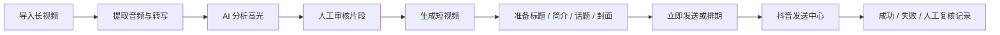

<div align="center">

# 牛马片场 · NiuMa Studio

**把长视频整理成可审核、可切片、可排期、可发布的短视频内容。**

Windows 本地运行的 AI 视频高光生产工作台，面向直播录像、访谈、综艺和其他长视频素材。

[中文](README.md) · [English](README.en.md) · [快速开始](docs/PROJECT_GUIDE.md) · [通用启动](docs/PORTABLE_SETUP.md) · [备份恢复](docs/BACKUP_AND_RESTORE.md) · [技术说明](docs/TECHNICAL_REFERENCE.md) · [路线图](ROADMAP.md)


</div>

> [!IMPORTANT]
> 牛马片场是本地单用户工具，不是云端 SaaS。真实投稿依赖用户自己的平台账号和本机 Chrome 登录状态；项目不会绕过二维码、短信、验证码、滑块或平台风控。

## 产品预览

> [!NOTE]
> 以下为经过脱敏处理的 Windows 本地运行截图，仅用于展示页面布局和工作流程，不包含真实任务内容、账号凭据或个人信息。

### 工作台


### 任务详情


### 片段审核


### 发送中心


## 零配置体验 Demo

还没有视频、API Key 或平台账号时，可以先启动隔离 Demo：

```powershell
.\scripts\start.ps1 -Demo
```

Demo 会使用独立的 `demo-data/` 和 `workspace/demo/`，生成虚构任务、AI 候选片段、切片与安全的 `manual_export` 发布草稿。它不会连接真实平台、不会使用正式数据库，也不会启动发布调度器。

恢复初始 Demo：

```powershell
.\scripts\start.ps1 -Demo -ResetDemo
```

## 为什么做这个项目

长视频切片通常不是“剪一刀”这么简单。真正耗时的是转写、找高光、反复审核、生成多个版本、准备平台文案、安排发布时间，以及记录每一次发布结果。

牛马片场把这些步骤收拢到一条本地工作流中：

- **AI 找高光**：支持远程 OpenAI-compatible / DeepSeek 和本地 Ollama。
- **人工可控**：候选片段可以启用、禁用，并修改标题、摘要和出入点。
- **统一生产**：转写、切片、文案、封面帧、排期和执行记录集中管理。
- **本地优先**：视频、数据库、API Key 和浏览器登录状态保留在用户电脑。
- **保守发布**：只有获得明确平台成功证据才标记为已发布；结果不确定时进入人工复核。

## 工作流程



## 当前能力

| 模块 | 能力 | 状态 |
| --- | --- | --- |
| 素材管理 | 浏览器上传、本地路径、NAS 路径、独立任务目录 | ✅ 可用 |
| 语音转写 | 火山引擎远程转写、faster-whisper 本地转写 | ✅ 可用 |
| AI 选片 | 通用内容价值、综艺笑点优先、长内容分段分析 | ✅ 可用 |
| 审核切片 | 编辑候选、保存选择、按需生成新切片版本 | ✅ 可用 |
| 内容准备 | 标题、简介、话题、封面帧、账号和可见范围 | ✅ 可用 |
| 排期计划 | 批量预览、跨午夜窗口、月历、续接最晚排期 | ✅ 可用 |
| 数据保护 | SQLite 一致性备份、清单校验、恢复前回滚与升级保护 | ✅ 可用 |
| 抖音发布 | 发送中心 + Windows Chrome Worker + 独立浏览器账号目录 | 🟡 需逐账号灰度 |
| B站发布后端 | API、Publisher 与既有历史保留，当前前台和自动同步不启用 | ⚪ 兼容保留 |
| 字幕工作台 | ASS / FFmpeg 字幕成片 | 🟡 独立使用，未强绑全自动流程 |
| 多用户与云端部署 | 权限系统、多人协作、公网服务 | ❌ 暂不支持 |

## 快速开始

### Windows + Docker Desktop（推荐）

```powershell
git clone https://github.com/damingishere-coder/Ai-Clip-Workflow.git
cd Ai-Clip-Workflow
.\scripts\setup.ps1
.\scripts\doctor.ps1
.\scripts\start.ps1
```

脚本会自动：

- 创建并保留本地 `.env`
- 生成随机管理 Token 与 Worker Token
- 创建通用视频存储目录
- 检查 Docker、Compose、端口与写权限
- 启动正式工作台并等待健康检查

浏览器地址：

```text
http://127.0.0.1:8001
```

停止服务：

```powershell
.\scripts\stop.ps1
```

### 备份、恢复与升级保护

创建经过 SQLite 完整性和 SHA-256 校验的备份：

```powershell
.\scripts\backup.ps1
```

升级代码前先创建回滚点：

```powershell
.\scripts\pre_upgrade.ps1
git pull --ff-only
.\scripts\acceptance.ps1
```

安全恢复备份：

```powershell
.\scripts\restore.ps1 `
  -BackupPath .\backups\niuma-studio-manual-YYYYMMDD-HHMMSS.zip `
  -ConfirmRestore `
  -StopServices
```

备份默认包含数据库和 `.env`，不包含原视频；包含 `.env` 的 ZIP 可能含 API Key 与 Token，不能上传到公开位置。完整说明见 [备份恢复指南](docs/BACKUP_AND_RESTORE.md)。

### 开发热重载

```powershell
.\scripts\start.ps1 -Development
```

正式 `docker-compose.yml` 不再启用热重载；开发模式通过 `docker-compose.dev.yml` 单独挂载代码目录。

### 真实抖音 / B站发布

```powershell
.\scripts\start.ps1 -WithPublisher
```

此模式需要 Windows、Google Chrome、平台账号人工登录，以及二维码、短信、验证码和风控处理。第一次真实发布必须使用一条低风险测试视频。

### 本地 Python

```powershell
python -m venv .venv
.\.venv\Scripts\Activate.ps1
python -m pip install --upgrade pip
pip install -r requirements.txt
.\scripts\setup.ps1
uvicorn app.main:app --reload --port 8001
```

完整启动模式、自定义存储路径和 Demo 说明见 [通用启动指南](docs/PORTABLE_SETUP.md)。

## 首次成功标准

完成安装后，建议先验证生产链路，不要直接测试真实投稿：

1. 首页和 `/health` 可以正常打开。
2. 上传一条 1～3 分钟测试视频并创建任务。
3. 转写与 AI 分析完成后出现至少一条候选片段。
4. 在审核页选择片段并生成一个本地短视频。
5. 生成的内容可以进入发送中心。

排期和真实投稿属于第二阶段验证，不应成为第一次安装的阻塞条件。

## 运行边界

- 目前面向 **Windows 本地单用户**，使用 FastAPI、SQLite 和本地文件系统。
- 正式模式默认发布方式为 `local_browser`；`manual_export` 只生成本地发布包。
- Demo 模式固定关闭调度器并使用 `manual_export`，不连接真实账号。
- 登录失效、验证码、风控或结果不确定时，任务进入 `NEED_REVIEW`，不会自动重复上传。
- 平台页面可能变化，抖音和B站真实投稿能力需要逐账号、逐版本验证。
- 项目不会保存平台账号密码，也不会尝试绕过平台安全机制。

详细状态、Scheduler、Worker、API 和发布终态说明见 [技术参考](docs/TECHNICAL_REFERENCE.md)。

## 文档

| 文档 | 内容 |
| --- | --- |
| [通用启动指南](docs/PORTABLE_SETUP.md) | setup、doctor、正式模式、Demo、开发模式和真实发布 |
| [新手启动指南](docs/PROJECT_GUIDE.md) | 环境准备、配置、首次测试和常见问题 |
| [备份恢复指南](docs/BACKUP_AND_RESTORE.md) | 数据库、`.env`、媒体文件、恢复回滚和升级保护 |
| [技术参考](docs/TECHNICAL_REFERENCE.md) | 架构、存储、排期、发布状态和测试命令 |
| [依赖维护策略](docs/DEPENDENCY_POLICY.md) | 固定版本、升级流程与 CI 验证 |
| [Release 检查清单](docs/RELEASE_CHECKLIST.md) | 自动化、Windows 实机、隐私与正式发布检查 |
| [路线图](ROADMAP.md) | 后续版本计划和暂不支持范围 |
| [贡献指南](CONTRIBUTING.md) | Issue、开发环境、测试和 Pull Request 规则 |
| [安全策略](SECURITY.md) | API Key、Cookie、本地数据与漏洞报告方式 |
| [更新日志](CHANGELOG.md) | 公开版本变化 |

## 开发与测试

```powershell
.\.venv\Scripts\Activate.ps1
pytest -v
```

CI 目前检查：

- Python 编译与 Ruff
- pytest
- JavaScript 语法
- PowerShell 语法
- 正式、开发和 Demo Compose 配置
- 敏感运行时文件与备份 ZIP
- 隔离 Demo 建库与数据数量
- 备份、恢复和回滚往返测试
- 最终 Docker 镜像构建、健康检查与主要页面

自动化测试使用独立数据，不应连接真实平台账号或触发真实投稿。完整开发约定见 [CONTRIBUTING.md](CONTRIBUTING.md)。

## 参与贡献

欢迎提交 Bug、功能建议、文档改进和平台适配修复。开始之前请阅读 [贡献指南](CONTRIBUTING.md)。

涉及平台发布自动化的变更必须保留人工验证与风控边界，不接受绕过验证码、登录验证或平台限制的实现。

## License

本项目使用 [MIT License](LICENSE)。第三方依赖和外部服务仍分别受其自身许可证、服务条款及平台规则约束。

---

<div align="center">

如果这个项目对你有帮助，欢迎 Star、提交 Issue，或分享你的使用反馈。

</div>
