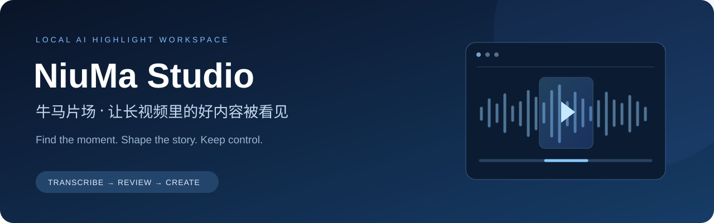
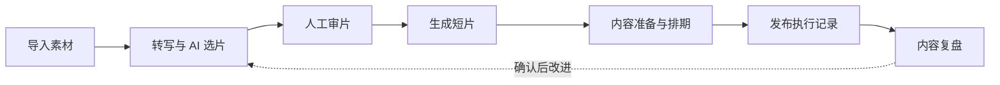

<div align="center">



# 牛马片场 · NiuMa Studio

**从一段长视频，到值得分享的短片。**

在自己的 Windows 电脑上，完成转写、AI 找高光、人工审片、切片、内容准备与排期。

[English](README.en.md) · [快速开始](#快速开始) · [界面预览](#界面预览) · [使用文档](docs/README.md) · [更新日志](CHANGELOG.md)

[](https://github.com/damingishere-coder/Ai-Clip-Workflow/actions/workflows/ci.yml)
[](CHANGELOG.md)


[](LICENSE)

</div>

## 让制作流程连起来

素材很长，真正花时间的往往是找片段、反复审核，以及把多个成片整理成可发布的内容。牛马片场把这些步骤放在同一个工作台中，保留每一步的任务状态、人工选择和执行记录。

| 找到内容 | 做成短片 | 持续改进 |
| --- | --- | --- |
| 上传 / 本地 / NAS 素材导入 | 查看原文并调整片段起止点 | 导入抖音作品指标、确认归因 |
| 本地 faster-whisper 转写与简体输出 | FFmpeg 切片、字幕独立审核 | 周总结与 Prompt 版本对比 |
| AI 高光候选与结构化评分 | 准备标题、话题、封面帧 | 确认改进建议、预览动态排期 |



**本地优先，处理方式由你配置。** 视频、数据库与浏览器登录状态保存在本机；选择远程转写或 AI 服务时，相应音频或文本会发送给所选服务。转写支持本地模式；AI 支持受控 Codex CLI，并保留 OpenAI-compatible / DeepSeek、Ollama 兼容入口。各入口需要对应的本地环境或账号配置。

## 界面预览

下图为已公开的脱敏界面截图，展示工作流程；具体控件以当前版本为准。


<details>
<summary><strong>查看任务详情、片段审核与发送中心</strong></summary>

### 任务详情


### 片段审核


### 发送中心


</details>

## 快速开始

### Windows 原生运行

准备 **Windows 10 / 11、Python 3.12+、Git、FFmpeg / FFprobe**，并确保命令能在 PowerShell 中运行。真实发布还需要本机 Google Chrome。

在准备存放项目的目录打开 PowerShell：

```powershell
git clone https://github.com/damingishere-coder/Ai-Clip-Workflow.git
cd Ai-Clip-Workflow
python -m venv .venv
.\.venv\Scripts\python.exe -m pip install -r requirements.txt
.\scripts\setup.ps1
.\scripts\start_native.ps1
```

打开 **[本地工作台](http://127.0.0.1:8001)**，在设置中检查转写与 AI 配置，先用一条短视频完成“导入 → 分析 → 审片 → 生成本地成片”。

- `setup.ps1` 会保留已有 `.env`；首次初始化生成本地 Token 与目录配置。
- 原生启动默认使用 E 盘素材存储。没有 E 盘时可运行 `.\scripts\start_native.ps1 -StorageRoot D:\NiuMaData`，路径换成自己的目录。
- 离线转写还需准备模型；NVIDIA GPU 环境见 [本地部署指南](docs/DEPLOYMENT.md)。
- 已使用 RunDock 托管时，通过原服务记录启停，避免重复占用 `8001` / `8765`。
- 手动启动的服务使用 `.\scripts\stop_native.ps1` 停止。

完整说明：[新手指南](docs/PROJECT_GUIDE.md) · [环境与启动模式](docs/PORTABLE_SETUP.md) · [常见部署问题](docs/DEPLOYMENT.md)

### 先试用隔离 Demo

已安装并启动 Docker Desktop 时，可在克隆后的项目目录执行：

```powershell
.\scripts\start.ps1 -Demo
```

Demo 使用虚构任务、独立数据库与 `manual_export` 草稿，关闭发布调度，不需要 API Key 或真实平台账号。它只演示工作台流程。停止 Demo 使用 `.\scripts\stop.ps1 -Demo`，需要恢复样例时使用 `.\scripts\start.ps1 -Demo -ResetDemo`。

## 能力与使用边界

| 能力 | 当前状态 |
| --- | --- |
| 素材、转写、AI 选片、审核与切片 | 已实现；需配置所选模型与服务 |
| AI 恢复 | 按单元保留进度和证据；不确定结果须确认后重试 |
| 内容复盘、周总结、动态排期 | 已实现；建议应用、归因确认与排期预览保留人工入口 |
| 抖音发布 | Windows Chrome Worker 执行；需登录与逐账号实测 |
| B站 | 保留后端与历史兼容，当前前台和自动同步不启用 |
| 字幕 | 独立工作台；全自动流程不自动烧录字幕 |
| 云端多人协作 | 当前不支持，面向本地单用户 |

> [!IMPORTANT]
> 真实投稿需要你拥有素材使用权并完成平台登录、验证和内容审核。系统不绕过验证码或风控；发布结果不确定时进入人工复核。首次体验建议先生成本地短片，再验证真实发布。

## 版本与同步

**2.3.0 将既有本地运行功能统一收拢到 `master`。** 根目录 `VERSION` 表示代码版本；正式安装发布以 [GitHub Releases](https://github.com/damingishere-coder/Ai-Clip-Workflow/releases) 为准。版本号更新不代替最终发布验收。

后续只维护一个稳定主干：短期 `codex/*` 分支 → PR → 检查通过 → 合并 `master` → 更新既有运行服务。历史实验不视为正式版本，详见 [分支与版本维护](docs/BRANCHING.md)。

已有安装升级前先备份，且确认实际运行目录：

```powershell
.\scripts\pre_upgrade.ps1
git status --short --branch
```

工作区干净、位于 `master` 且没有本地独有提交时，执行 `git pull --ff-only`，再按 [部署说明](docs/DEPLOYMENT.md) 重启已有服务。含未提交修改或正在使用功能分支的目录，先按 [分支维护指南](docs/BRANCHING.md) 核对，不直接覆盖。

## 文档导航

| 我想做什么 | 从这里开始 |
| --- | --- |
| 查看当前交付与近期工作 | [项目进度](PROJECT_STATUS.md) · [下一步](NEXT_STEPS.md) |
| 安装、配置、处理第一条视频 | [新手指南](docs/PROJECT_GUIDE.md) |
| 了解启动方式与 Demo | [通用启动](docs/PORTABLE_SETUP.md) |
| 备份数据或回滚升级 | [备份与恢复](docs/BACKUP_AND_RESTORE.md) |
| 查看技术实现与系统边界 | [技术参考](docs/TECHNICAL_REFERENCE.md) · [架构](docs/ARCHITECTURE.md) |
| 了解版本变化与后续计划 | [Changelog](CHANGELOG.md) · [Roadmap](ROADMAP.md) |
| 维护主干或准备发布 | [分支维护](docs/BRANCHING.md) · [发布检查](docs/RELEASE_CHECKLIST.md) |
| 报告问题或参与开发 | [Issues](https://github.com/damingishere-coder/Ai-Clip-Workflow/issues) · [贡献指南](CONTRIBUTING.md) · [安全策略](SECURITY.md) |

## 参与贡献

欢迎提交可复现的问题、安装体验反馈、文档改进与测试。提交前请阅读 [贡献指南](CONTRIBUTING.md)，不要上传真实视频、数据库、API Key、Cookie 或运行日志中的私人信息。

采用 [MIT License](LICENSE)。第三方组件见 [THIRD_PARTY_NOTICES.md](THIRD_PARTY_NOTICES.md)。
