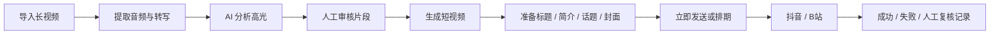

<div align="center">

# 牛马片场 · NiuMa Studio

**把长视频整理成可审核、可切片、可排期、可发布的短视频内容。**

Windows 本地运行的 AI 视频高光生产工作台，面向直播录像、访谈、综艺和其他长视频素材。

[中文](README.md) · [English](README.en.md) · [快速开始](docs/PROJECT_GUIDE.md) · [技术说明](docs/TECHNICAL_REFERENCE.md) · [路线图](ROADMAP.md)


</div>

> [!IMPORTANT]
> 牛马片场是本地单用户工具，不是云端 SaaS。真实投稿依赖用户自己的平台账号和本机 Chrome 登录状态；项目不会绕过二维码、短信、验证码、滑块或平台风控。

## 为什么做这个项目

长视频切片通常不是“剪一刀”这么简单。真正耗时的是转写、找高光、反复审核、生成多个版本、准备平台文案、安排发布时间，以及记录每一次发布结果。

牛马片场把这些步骤收拢到一条本地工作流中：

- **AI 找高光**：支持远程 OpenAI-compatible / DeepSeek 和本地 Ollama。
- **人工可控**：候选片段可以启用、禁用，并修改标题、摘要和出入点。
- **统一生产**：转写、切片、文案、封面帧、排期和执行记录集中管理。
- **本地优先**：视频、数据库、API Key 和浏览器登录状态保留在用户电脑。
- **保守发布**：只有获得明确平台成功证据才标记为已发布；结果不确定时进入人工复核。

## 工作流程



## 当前能力

| 模块 | 能力 | 状态 |
| --- | --- | --- |
| 素材管理 | 浏览器上传、本地路径、NAS 路径、独立任务目录 | ✅ 可用 |
| 语音转写 | 火山引擎远程转写、faster-whisper 本地转写 | ✅ 可用 |
| AI 选片 | 通用内容价值、综艺笑点优先、长内容分段分析 | ✅ 可用 |
| 审核切片 | 编辑候选、保存选择、按需生成新切片版本 | ✅ 可用 |
| 内容准备 | 标题、简介、话题、封面帧、账号和可见范围 | ✅ 可用 |
| 排期计划 | 批量预览、跨午夜窗口、月历、续接最晚排期 | ✅ 可用 |
| 抖音 / B站发布 | Windows Chrome Worker + 独立浏览器账号目录 | 🟡 需逐账号灰度 |
| 字幕工作台 | ASS / FFmpeg 字幕成片 | 🟡 独立使用，未强绑全自动流程 |
| 多用户与云端部署 | 权限系统、多人协作、公网服务 | ❌ 暂不支持 |

## 快速开始

### 方式一：Docker Desktop（推荐）

1. 安装并启动 Docker Desktop。
2. 克隆项目并进入仓库目录。
3. 复制环境变量模板：

```powershell
Copy-Item .env.example .env
```

4. 根据自己的电脑填写 `.env` 中的存储路径和 AI 配置。
5. 启动项目：

```powershell
docker compose up -d
```

6. 浏览器打开：

```text
http://127.0.0.1:8001
```

健康检查：

```text
http://127.0.0.1:8001/health
```

### 方式二：本地 Python

```powershell
python -m venv .venv
.\.venv\Scripts\Activate.ps1
python -m pip install --upgrade pip
pip install -r requirements.txt
Copy-Item .env.example .env
uvicorn app.main:app --reload --port 8001
```

第一次使用建议完整阅读 [新手启动指南](docs/PROJECT_GUIDE.md)。

## 首次成功标准

完成安装后，建议先验证生产链路，不要直接测试真实投稿：

1. 首页和 `/health` 可以正常打开。
2. 上传一条短测试视频并创建任务。
3. 转写与 AI 分析完成后出现候选片段。
4. 在审核页选择片段并生成短视频。
5. 生成的内容可以进入发送中心。
6. 排期预览能够正确显示北京时间。

只有在 Windows Worker 正常、平台账号已登录并完成低风险测试后，再验证真实投稿。

## 运行边界

- 目前面向 **Windows 本地单用户**，使用 FastAPI、SQLite 和本地文件系统。
- 默认发布方式为 `local_browser`；`manual_export` 只生成本地发布包。
- 登录失效、验证码、风控或结果不确定时，任务进入 `NEED_REVIEW`，不会自动重复上传。
- 平台页面可能变化，抖音和 B站真实投稿能力需要逐账号、逐版本验证。
- 项目不会保存平台账号密码，也不会尝试绕过平台安全机制。

详细状态、Scheduler、Worker、API 和发布终态说明见 [技术参考](docs/TECHNICAL_REFERENCE.md)。

## 文档

| 文档 | 内容 |
| --- | --- |
| [新手启动指南](docs/PROJECT_GUIDE.md) | 环境准备、配置、启动、首次测试和常见问题 |
| [技术参考](docs/TECHNICAL_REFERENCE.md) | 架构、存储、排期、发布状态和测试命令 |
| [路线图](ROADMAP.md) | 后续版本计划和暂不支持范围 |
| [贡献指南](CONTRIBUTING.md) | Issue、开发环境、测试和 Pull Request 规则 |
| [安全策略](SECURITY.md) | API Key、Cookie、本地数据与漏洞报告方式 |
| [更新日志](CHANGELOG.md) | 公开版本变化 |

## 开发与测试

```powershell
.\.venv\Scripts\Activate.ps1
pytest -v
```

常用基础检查：

```powershell
python -m compileall app
python scripts/test_ai_json_validation.py
python scripts/test_mock_transcript_analysis.py
python scripts/test_transcript_markdown_format.py
```

自动化测试使用独立数据，不应连接真实平台账号或触发真实投稿。完整开发约定见 [CONTRIBUTING.md](CONTRIBUTING.md)。

## 参与贡献

欢迎提交 Bug、功能建议、文档改进和平台适配修复。开始之前请阅读 [贡献指南](CONTRIBUTING.md)。

涉及平台发布自动化的变更必须保留人工验证与风控边界，不接受绕过验证码、登录验证或平台限制的实现。

## License

本项目使用 [MIT License](LICENSE)。第三方依赖和外部服务仍分别受其自身许可证、服务条款及平台规则约束。

---

<div align="center">

如果这个项目对你有帮助，欢迎 Star、提交 Issue，或分享你的使用反馈。

</div>
