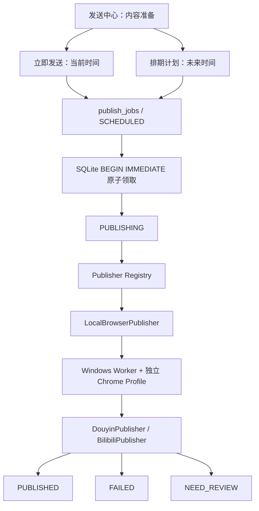

# 系统架构

## v2.6.0 已运行验收

2026-09-15 原 Web/Worker 已更新至 75cdd93，真实运行、18 次页面/7 个资源及数据保护通过。独立 Workflow Job 继续执行生产，发布 Scheduler 保持原链路；Inbox 是现有事实的只读投影。详见 PROJECT_STATUS 当前交付记录，下文各 PR 说明不代表仍待实施。

## v2.6.0 交付边界

素材池 → 冻结批次 → 原 Workflow Job 串行导入与生产 → 不可变成片证据 → 人工统一审片及字幕决定 → 原内容准备/排期。production_workbench_service 只读聚合现有状态，Review Inbox 不持久化另一份状态机。复制、AI、切片失败及重启仍由原 Job/checkpoint 恢复；不确定 AI 不扩大重试权限。所有业务已顺序合并，实际版本与部署以 PROJECT_STATUS.md 为准。

## 批次自动预切的复用边界

新增 batch_pipeline_service 是现有 Pipeline 的批次策略适配，不是第二个任务状态机。只允许冻结配置指定的自动任务通过 Workflow Job 运行，入队和实际执行双重检查允许步骤；成功预切后按 cut_run_evidence 验证完整版本并暂停。恢复仍使用原 AutoPipelineCheckpoint，不添加旧 Job 指纹字段或改旧恢复解释。后续字幕与内容准备由已合并的人工凭据服务控制。

## v2.6 批次人工审核边界

批次原片导入 → 受租约保护的 Workflow Job 切片 → `cut_run_evidence` → 实际视频预览 → `production_review_service.confirm` → 可选字幕审核与验证 → 显式内容准备。只有批次任务进入新门槛；`reviewed` 与 AI 反馈不是成片确认。确认原子保存不可变 manifest 及字幕决定，不生成文案、不排期、不发布。

服务层提前检查防止无确认时调用文案/封面；SQLite 触发器在同步、直接创建、批量创建、队列刷新、自动续接及排期/派发写事务再次核对。已有任务终态不因策略失效而丢失。字幕 Job 冻结确认 ID/哈希，批次即使携带旧 continue_pipeline 参数也不能续接自动排期。新批次重处理只走既有 Workflow Job 租约与全局容量控制，旧同步入口仅保留旧任务兼容。

文件版本使用实际路径及 stat 身份、大小和时间戳核对；数据库保证事务并发一致性，不宣称抵御同一操作系统用户恶意篡改文件或 SQLite。抽帧、AI、Scheduler 与字幕核心算法保持原实现。

## v2.6 切片执行证据

保持原 FFmpeg 参数、cut_runs 激活规则和租约 fencing。CutPlan 已执行的 start 与 duration 回传为毫秒计划边界（不宣称解码帧 PTS，fast copy 仍受关键帧影响），output_clip 不再把执行期间修改后的候选时间当作已执行时间。切片前后复核活动 Run、选集/来源/边界和原片文件标识，证据与成片结果原子提交；任意不一致拒绝激活并保留旧成片。新 cut_run_evidence 为后续人审凭据提供依据，不代表已经人工审核通过。

源文件现有采样指纹标明 size-head-tail-v1；文件 stat 用于识别正常本机文件变化，不宣称抵御同用户恶意恢复时间戳等篡改。没有把它冒充批量导入所做的全量 SHA-256。旧 Prompt、Analyzer、评分、字幕时间轴和发布执行器不变。

## Workflow Job 全局执行容量（v2.6 开发中）

`claim_job` / `claim_next_job` 在 SQLite 写事务内共用有效 running 租约门槛，默认同时只领取一个 Job。领取仍保持原重试/取消/到期恢复语义，同秒按插入顺序。一个有效取消请求尚未结束执行时不会提前让出槽位。

仅租约隔离不足以阻止父进程意外退出后存活子进程继续占用 CPU/GPU。`job_worker.execute_job` 因此在真实处理前进入 `workflow_capacity_service.execution_slot`，使用实际数据库旁的持久 OS 文件锁，Windows msvcrt / POSIX flock。锁由执行子进程持有，退出时由 OS 释放，锁文件保留而不按 PID 删除。等待有取消/租约检查与 120 秒上限，不自动终止无可靠身份的其他进程；到期报告失败，处理函数尚未运行。

该锁不锁 Publisher Scheduler，不引入新服务/队列，也不替代 AI checkpoint 或提交 fencing。同步单任务兼容入口沿用原机制，新的后台 Workflow Job 均通过该边界。

## v2.6 批次导入接入（开发中）

`material_batch_service.create_batch` 复用 `insert_task_record_with_connection` 与原 Workflow Job 创建函数，以单事务建立真实无源 Task、批次及 material_import Job；不在请求事务复制媒体。`material_import_service.execute_import` 由原 Worker dispatch 执行，复制和完成证据受当前租约约束，文件路径含 token 防止迟到进程覆盖。成功证据与任务源原子提交，随后 Job 完成；该两步之间重启时验证已提交副本后完成原 Job。

Profile/Prompt/Provider/反馈/视觉沿用既有 generation_snapshot_v1，任务配置编辑和不匹配 Provider 被阻止；单任务兼容路径不受此限制。待导入批次不能进入转写、AI、切片或自动生产。新增表描述批次与来源证据，进度由原 Task/Job 投影，不另建队列状态机。

## v2.6 开发：本机素材登记

`material_catalog_service` 在用户显式输入目录后读取非递归元数据、保存不可变预览；确认时重新验证目录和文件身份，在同一 SQLite 事务写 source_materials 与幂等登记回执。它不扩展 storage_service 的媒体下载根、不启动 Job、不打开模型。此阶段 identity_sha256 仅证明保存的元数据，后续 task-bound 导入 Job 才计算完整视频哈希和复制产物校验。Queue 继续复用 workflow_jobs，见 [内容生产队列](CONTENT_PRODUCTION_QUEUE.md)；正式服务仍为 v2.5.5。

## 当前代码：v2.5.5 人工经验与受控实验

Analyzer 保留原调用链，增加轻量初始观察到 AI Run；明确人工评价复用 clip_feedback，以 Run + 候选来源 + 哈希归因。`content_intelligence_service` 冻结人工统计和官方作品特征；`content_challenger_service` 保存独立归档的 Prompt 草稿、版本与差异；`challenger_trial_service` 在用户明确创建试验时绑定原任务/Job/Run。`challenger_experiment_service` 复用 Content Review 实验、官方事实与 Prompt 版本，验证实际 Job/Run 控制条件、冻结结论并提供独立人工策略启用/回退；报告、草稿、试验和结论都不自动改生产。见 [Content Intelligence](CONTENT_INTELLIGENCE.md)。

## v2.5.0 已交付：可选视觉接入

正式服务已交付五种 Content Profile、候选内视觉验证、辅助综合评审与证据/缓存生命周期。视觉默认关闭，任务显式选择后冻结到原 Workflow Job，原子提交关联 AI Run；普通可选证据失败不改变文字覆盖率。以下 PR1/PR2 和按日期的阶段段落为历史说明，最终流程见 [Visual Signal](VISUAL_SIGNAL.md)，真实版本/部署证据见 PROJECT_STATUS.md。


## 历史 PR2：v2.5 可选视觉证据基础

`ai.visual_provider` 定义独立图像能力，`CodexCliProvider.generate_visual_json` 沿用现有执行配置。`visual_evidence_service` 在有效 Workflow Job 内冻结附件请求，通过 `unit_checkpoint.execute_checkpointed_ai_unit` 的 `optional-visual-v1` namespace 执行，不能走无 lease 的 untracked 分支。`candidate_visual_evidence` 提供候选/Job/Run 与相对图片目录的可查询引用，支持未完成 Run 的失败追踪和后续缓存清理；不另建后台队列，不复制候选事实。

新的请求身份包含内容 SHA、实际帧 PTS/顺序、Prompt/schema 和模型指纹，随机目录名不改变请求。已开始的调用若丢失 checkpoint，证据表的 pending/completed 标识阻止把它当作新调用。成功缓存不要求图片仍在；不确定调用保持 unavailable 并留证。Run 关联由现有候选/分析/Task 原子事务接入，当前仅提供绑定函数，尚未启用。旧 Analyzer、文字覆盖率与生产策略不变。数据库/恢复说明见 [数据库结构](DATABASE_SCHEMA.md) 与 [Visual Signal](VISUAL_SIGNAL.md)。

## 历史 PR1：v2.5 基础模块

`frame_sampling_service.plan_candidate_frames` 负责原片绝对时间计划；`CandidateFrameSampler` 在任务 `analysis/visual` 内执行有限抽帧，复用现有路径白名单、FFmpeg 与进程树终止能力。实际帧 PTS、原片/图片 SHA、采样来源与失败原因进入本地 manifest。一轮共享候选/字节/时间预算；不调用发布封面服务、不改变任务或 Job 状态机，也不新增数据库迁移。

后续通过可选视觉证据服务接入各 Analyzer 的扩展后、Judge 前位置，仍以 `ai_analysis_runs`、checkpoint 和既有候选为事实基础。VisualProvider、生命周期清理及 UI 尚未交付，生产入口保持关闭；实现、实际接口验证和边界见 [Visual Signal](VISUAL_SIGNAL.md)。

## 2026-09-14：2.4.0 工程交付与试用范围

五种 Profile 和任务/Job/Run 冻结证据已经接入；访谈、知识共用内容分析器，三个旧 Analyzer 保留。试用状态仅在创建页、说明和任务详情显示，不属于执行策略，不更改不可变 Profile/Prompt 版本或数据库种子。工程检查通过后继续后续版本；真实质量按用户批准在日常使用中补验，历史章节中的人工质量前置门槛已被替代，不能据此回填人工通过。

本次版本收口没有新增迁移、修改队列或发布状态机；Web、Worker、备份清单版本同步为 2.4.0。数据格式、租约代际、字幕 revision、人工审片与发布确认边界不变。以下按日期记录的实现阶段保留作历史背景，当前进度以 PROJECT_STATUS 为准。

## 2026-09-14：Judge 反馈快照与后续 Job 幂等

新综艺 `ai_analysis` / `auto_pipeline` Job 在原创建事务中使用现有反馈查询，保存 `generation_snapshot_v1.snapshot.feedback_context`（来源、查询版本、完整反馈项目）。外层哈希覆盖反馈；执行时通过 `ComedyAnalysisRequest.feedback_context` 注入，Run meta 保存相同集合。明确 `[]` 不查询最新反馈；只有旧 Job 缺字段时使用旧实时查询。现有反馈来源语义保持原样，不把默认 keep 追认为人工接受，不产生新的学习或策略应用。

recall/expansion/global namespace 的输入指纹不增加反馈字段，Judge 单元继续按实际 Prompt 计算 request_fingerprint。因此旧成功单元与旧恢复协议不因新增元数据失效。Run 可还原实际 Judge 输入，不只依赖无法逆推出正文的哈希。

`mark_job_completed_with_followup` 复用已有 Job 时，在同一事务连接校验原策略快照，再比较调用方业务参数；不能按当前模型或新反馈重新冻结旧 Job。缺反馈/Provider 身份字段的旧快照保持兼容，损坏哈希与不同 start_step/retry 仍拒绝。无数据库迁移。

## 2026-09-14：五 Profile 与 Provider 执行边界

`builtin_profiles()` 正式注册五种模板；访谈和知识均进入 `content_analyzer`，分别使用 story_value / knowledge_value 等通用维度，不复制 Analyzer、不复用 humor_score 承载新含义。创建页从 Registry 读取模板及约束，先选择 Profile、有效 Prompt、Provider，再在任务插入事务冻结策略。

`provider_snapshot` 冻结实际模型、协议、配置身份和相关非密钥选项。任务默认 Job 使用创建时快照；显式 Provider 选择捕获当轮配置，不更改任务默认。执行入口与 Provider factory 在作用域内检查一致性，漂移明确失败，不静默切模型；恢复原配置后可沿用原账本。旧 Job 缺少身份快照时保持旧路径，旧 checkpoint 算法不变。

默认分析按钮不传 Provider，从任务快照解析；旧失败 Job 的恢复同样读取原 Provider。Provider 地址可能包含认证信息，因此新快照对地址/响应路径/认证目录/可执行路径只存哈希，展示仅用模型和无凭据域名。没有改变全局设置、登录方式或服务架构。

## 2026-09-14：共享内容分析流程

`content_profile_definitions.builtin_profiles()` 组合冻结的三个旧基线及新 `interview_profile()`。Registry 的 `content` 路由进入 `content_analyzer.analyze_content`，按 Profile 进行重叠文字窗口召回、候选局部上下文扩展及全局评分。当前新规则只接受文字证据；后续知识模板使用同一实现。

所有单元复用 `execute_checkpointed_ai_unit`，指纹包含 Profile 全配置、Prompt、实际 Provider 身份、转写及任务数量/时长。JSON、候选边界、逐句起止点、关键时刻归属、Judge 来源集合和评分维度都在成功缓存前及复用时校验。部分失败留下不完整元数据，自动切片沿用旧门禁拒绝继续；不确定单元不会自动重发。

候选专属维度存既有 `quality_evidence`；`humor_score` 不承载故事分。Run 的轻量 observations 保留被拒绝/C 级证据，尚不产生学习建议。五模板创建 UI/完整 Provider 设置冻结属于 PR4，正式 v2.4 仍需真实样本与人工门禁。

## 2026-09-14：Content Profile Registry 与执行证据

`content_profile_service` 通过代码 Registry 校验已支持策略，读取 SQLite 不可变版本。三个旧 Analyzer 继续执行原流程；康熙的窗口、评分、门槛、数量、扩展和去重参数改从冻结基线读取，旧常量名称、Prompt 字节、评分顺序与 checkpoint 指纹继续兼容。

创建任务后在同一事务冻结 Prompt 与 Profile；显式更换 Profile 不改 Prompt，Prompt 重绑不改 Profile。新 Job 在入队事务冻结选片参数、Prompt、Profile 和 Provider 名，执行时使用该快照，Run 在原子候选提交中保存引用及有效参数。旧任务的新 Job 记录当次版本，旧 Job/历史 Run 不被追认。快照损坏、引用错配或未匹配算法的新规则均明确拒绝，不静默使用旧算法。

目前没有 Profile 编辑或正式版本切换 API；三类旧适配仅接受已审计的规则版本。访谈/知识共享算法、五 Profile 创建 UI、实际模型配置冻结属于后续 PR，尚未交付。

## 2026-09-14：Content Profile 基础

新增 `app/models/content_profile.py` 与 `app/services/content_profile_baselines.py`，尚未被任务、Analyzer 或数据库初始化引用，原三类执行链和 checkpoint 不变。后续使用代码策略契约 + SQLite 不可变版本 + 任务/Run 快照，沿用 FastAPI、本地文件、Workflow Job、Windows Worker。
具体架构、逐版本门禁见 [实施账本](CONTENT_PROFILE_ROLLOUT.md)。旧章节的远期基础设施设想不是本轮依赖，不引入 Redis、Celery 或微服务。

## 2026-08-24：字幕审核与交付证据链

```text
切片完成
→ source/clip 字幕草稿
→ pending_subtitle_review（自动流水线暂停）
   ├─ 明确跳过 → delivery_mode=original → 恢复元数据/发送任务
   └─ 审核 revision → workflow_jobs:subtitle → 临时渲染
      → FFprobe 验证 → 原子激活 → delivery_mode=subtitled
      → 恢复元数据/发送任务
```

- `subtitle_auto_workflow_service.py` 负责暂停点、交付决定、批量 checkpoint、恢复流水线及父进程异常清理。
- `job_worker.py` 仍采用单重型 Job 子进程；字幕 Job 与转写/切片共享 lease、heartbeat、取消和人工重试接口。
- 渲染尝试顺序为可用 `h264_nvenc`、`libx264`，音频可安全复制时优先复制，否则转 AAC；最终统一验证 H.264、`yuv420p`、音轨、时长和文件大小。
- 发布任务保存 `subtitle_delivery_mode` 及 revision/验证证据。自动字幕来源只有在审核、验证和文件三项同时成立时可进入发送中心。
- AI 纠错独立于自动流水线：Provider 返回的内容只能映射既有 cue 的文本，不允许改变时间、说话人或未知 cue；建议 revision 必须人工接受。

## 2026-08-23：统一字幕架构

```text
转写 checkpoint / 旧 transcript.md
            ↓
source subtitle_track → immutable subtitle_revision → subtitle_cues(ms)
            ↓ 按 output_clip 原片边界快照截取
clip subtitle_track   → immutable subtitle_revision → SRT/VTT/ASS/编辑器
```

- `subtitle_data_service.py` 是字幕数据事实入口，负责轨、版本、cue、同步、导入导出、质量检查和服务端波形 peaks。
- 原片轨只保存一条 active track；内容变化产生新 revision。切片轨记录来源 track/revision，未人工编辑时可同步，人工编辑后只进入 `pending_sync`。
- revision 内容不可原地更新；审核只改变 revision 状态，渲染必须固定引用 revision id，避免编辑过程中改变已排队输出。
- `pysubs2` 负责字幕格式与 ASS，不再手写固定分辨率 ASS。`wavesurfer.js` 仅消费服务端 peaks 与媒体流，不读取六小时完整音频到浏览器内存。
- 单条兼容入口和批量入口都只负责创建持久化字幕 Job；HTTP 请求不再同步等待 FFmpeg。批量入口额外负责全自动流水线恢复。

## 2026-08-23：长直播选片层

`long_live_talk` 使用独立的 `long_live_talk_analyzer`：

```text
结构化转写
→ 300 秒窗口（60 秒重叠）
→ 每窗口独立 AI 召回与 SQLite checkpoint
→ 成功窗口时间轴并集 / 完整转写时间轴 = coverage_ratio
→ 时间重叠 + 语义相似去重
→ 每小时密度筛选
→ 跨小时轮询合并
→ 总量上限
→ analysis.json + ai_analysis_runs + clip_candidates
```

自动流水线在 `CLIP_SELECTING` 入口读取当前 `analysis_meta`。`analysis_incomplete=true` 或 `coverage_ratio < 0.90` 会直接中断，所以后续 `VIDEO_CUTTING`、内容准备和发送任务创建均不会执行。手动切片入口使用相同门禁。

## 2026-08-23：长直播基础层

- 新建任务必须显式选择 `general`、`variety_comedy` 或 `long_live_talk`；数据库的 `general` 默认值只用于旧数据兼容。
- 数小时重型流程由 SQLite `workflow_jobs` 单 worker 串行领取，并为每个 Job 启动独立 Python 子进程。Job 使用 lease、heartbeat、尝试次数、取消标志和 checkpoint；Web 重启后可接管过期 lease，取消时终止子进程树。
- 创建任务前检查视频轨、音轨、时长、编码、分辨率、帧率、首尾抽样解码与 E 盘剩余空间；超过 6 小时只提示。
- 转写事实来源改为 `transcription_runs + transcription_chunks`。每块独立提交带校验和的结构化结果；`transcript.md` 是兼容导出。
- 本地 faster-whisper 保存词级毫秒时间戳与置信度。仅 `TRANSCRIPTION_DEVICE=auto` 自动探测 CUDA，显式 `cpu` 不覆盖。
- FFmpeg 音频提取写临时文件后原子替换，支持无进展超时、Job 取消和 Windows 进程树终止。

## 1. 当前架构概览

### 1.1 架构形态

当前 v2.5.5 继续保持 **FastAPI 单体应用 + SQLite + Windows 发布 Worker**。视频、AI、页面、内容复盘和调度器仍在同一个应用中；只有必须使用宿主系统 Chrome 的真实发布与作品指标同步动作由 Windows Worker 执行，不引入 Redis、Celery 或微服务。

v2.1 的架构目标不是云端多租户，而是把一台 Windows 电脑上的长视频生产与发布链路做完整、可恢复、可审计。SQLite 是唯一业务事实来源，E 盘任务目录保存大文件，浏览器 Profile 和平台登录态只保留在本机且不进入 Git。

```text
┌─────────────────────────────────────────────────────────┐
│                    浏览器 (127.0.0.1:8001)               │
└─────────────────────┬───────────────────────────────────┘
                      │ HTTP
┌─────────────────────▼───────────────────────────────────┐
│              FastAPI 单体应用 (uvicorn)                   │
│                                                         │
│  ┌──────────┐  ┌──────────┐  ┌────────────────────┐   │
│  │ routers/ │  │services/ │  │  services/ai/       │   │
│  │ 页面+API │──│ 业务逻辑  │──│  AI Provider 抽象   │   │
│  └──────────┘  └──────────┘  └────────────────────┘   │
│                                                         │
│  ┌──────────┐  ┌──────────┐  ┌────────────────────┐   │
│  │ models/  │  │  core/   │  │  db/                │   │
│  │ Pydantic │  │  配置管理  │  │  SQLite 连接+迁移    │   │
│  └──────────┘  └──────────┘  └────────────────────┘   │
└─────────────────────────────────────────────────────────┘
         │                │                  │
         ▼                ▼                  ▼
┌─────────────┐  ┌──────────────┐  ┌──────────────────┐
│   SQLite    │  │  本地文件系统  │  │  外部 AI API     │
│ workflow    │  │  任务产物目录  │  │  DeepSeek /      │
│ .sqlite3    │  │  视频/音频等  │  │  Ollama /        │
│             │  │              │  │  火山引擎         │
└─────────────┘  └──────────────┘  └──────────────────┘
```

### 1.2 技术栈一览

| 层次 | 技术选型 | 说明 |
| --- | --- | --- |
| **Web 框架** | FastAPI + uvicorn | 异步 HTTP 服务，端口 8001 |
| **模板引擎** | Jinja2 | 后台页面渲染，Apple 风格 UI |
| **数据库** | SQLite | 单文件数据库，`data/workflow.sqlite3` |
| **数据校验** | Pydantic v2 | 请求/响应模型校验，AI 结果解析 |
| **文件存储** | 本地文件系统 | Windows 本地目录，默认 `E:\直播间切片工作流存储` |
| **视频处理** | FFmpeg / FFprobe | 音频提取、视频切割、字幕合成、封面帧 |
| **语音转写** | faster-whisper / 火山引擎 | 本地模型或远程 API，输出逐句时间戳 |
| **AI 分析** | Codex CLI / DeepSeek API / Ollama | 受控本机进程与 Provider 抽象层，兼容 chat/completions 和 responses 协议 |
| **真实发布** | Playwright + 系统 Chrome | Windows Worker 使用每个平台/账号独立浏览器目录投稿 |
| **容器化** | Docker + docker-compose | 可选部署方式，开发/测试用 |

### 1.3 核心设计决策

- **单体业务应用**：页面、路由、视频、AI、SQLite 和 Scheduler 保持同一 FastAPI 应用；Windows Worker 只隔离宿主 Chrome 操作。
- **SQLite 单写入者**：只有 Docker 内的 FastAPI 可以读写 `workflow.sqlite3`；Windows Worker 不导入数据库仓储、不打开 SQLite，只通过 HTTP 返回账号检查/发布结果并写独立执行日志。
- **受管 FFmpeg**：长流程由持久化 Job worker 调用；已接入的音频提取支持进度、无进展超时、取消和进程树终止。
- **无外部消息队列**：工作流与发布队列均使用 SQLite 原子领取，无 Redis / Celery。
- **无用户体系**：单用户本地使用，通过 `LOCAL_ADMIN_TOKEN` 做简易鉴权。
- **统一定时调度**：立即发送与未来排期都先写 `SCHEDULED`，再由 `PublishScheduler` 原子领取。
- **终态原子提交**：平台结果、任务终态和事件由 FastAPI 在同一 SQLite 事务写入；任一步失败都会回滚，避免出现“平台结果已记但任务仍在发送中”。
- **调度循环自恢复**：单条任务异常不会阻塞后续排期；SQLite 临时异常只结束当前扫描，常驻循环按配置间隔继续重试并在健康接口公开连续失败次数。
- **执行日志恢复**：Worker 的 `/v1/executions/{execution_id}` 是跨进程中断恢复依据；已确认成功只补记终态，结果不确定一律进入人工复核，不自动重复投稿。
- **保守结果语义**：只有平台成功证据进入 `PUBLISHED`；不确定结果进入 `NEED_REVIEW`，禁止自动重复上传。

---

## 2. 模块分层

```text
app/
├── main.py                  ← FastAPI 应用入口，路由注册，中间件
├── core/
│   └── config.py            ← 环境变量读取，Settings 数据类
├── db/
│   └── database.py          ← SQLite 连接、建表、迁移、种子数据
├── models/
│   ├── task.py              ← Task / ClipCandidate / OutputClip 等 Pydantic 模型
│   └── settings.py          ← 配置相关 Pydantic 模型
├── routers/
│   ├── pages.py             ← 页面路由（Jinja2 模板渲染）
│   ├── tasks.py             ← 任务 CRUD + 处理流程 API
│   ├── files.py             ← 文件上传/路径选择 API
│   ├── media.py             ← 媒体文件访问 API
│   ├── ai_prompts.py        ← AI Prompt 方案管理 API
│   ├── publish.py           ← 发送中心 API
│   └── settings.py          ← 系统设置 API
└── services/
    ├── task_service.py      ← 任务状态编排（含字幕渲染、发布队列集成）
    ├── storage_service.py   ← 任务目录与文件路径管理
    ├── transcript_service.py← 转写服务（faster-whisper + 火山引擎）
    ├── video_cut_service.py ← FFmpeg 切割封装
    ├── ai_clip_service.py   ← AI 片段分析编排
    ├── ai_config_service.py ← AI 配置读写
    ├── ai_prompt_preset_service.py ← Prompt 方案服务
    ├── publish_service.py   ← 内容准备、账号和兼容 API
    ├── publish_scheduler.py ← SQLite 排期、原子领取、恢复和状态机
    ├── publish_repository.py← 发布结果脱敏与事件记录
    ├── publish_time.py      ← 北京时间输入与 UTC 存储
    ├── publishers/          ← Registry、模式 Publisher、抖音/B站 Publisher、Worker 客户端
    └── ai/
        ├── base.py          ← AI Provider 抽象基类
        ├── codex_cli_provider.py      ← 受控 Codex CLI Provider
        ├── local_model_provider.py    ← Ollama 本地 Provider
        ├── remote_responses_provider.py ← DeepSeek 远程 Provider
        ├── ai_clip_analyzer.py        ← AI 分析编排器
        └── diagnostics.py   ← AI 连接诊断
```

---

## 3. 数据存储

### 3.1 数据库

- **类型**：SQLite，单文件 `data/workflow.sqlite3`
- **连接方式**：`sqlite3.connect()`，每次请求 `@contextmanager` 获取连接
- **迁移方式**：`init_db()` 启动时自动执行 `CREATE TABLE IF NOT EXISTS` + 逐列 ALTER TABLE 补齐
- **种子数据**：启动时自动写入默认 AI Prompt 方案、字幕样式、平台配置

### 3.2 发布相关表

| 表名 | 用途 |
| --- | --- |
| `tasks` | 任务主表，状态流转 |
| `clip_candidates` | AI 候选片段 |
| `output_clip` | 输出切片记录 |
| `ai_prompt_presets` | AI Prompt 方案（3 套） |
| `ai_analysis_runs` | AI 分析历史 |
| `subtitle_style_presets` | 字幕样式预设 |
| `subtitle_jobs` | 字幕任务 |
| `publish_platform_configs` | 平台 OAuth 配置 |
| `publish_accounts` | 发布账号 |
| `publish_jobs` | 发布任务队列 |
| `publish_job_events` | 状态流转、领取、重试和平台结果事件 |

详见 [DATABASE_SCHEMA.md](DATABASE_SCHEMA.md)

### 3.3 文件存储

- 存储根目录由 `STORAGE_ROOT` / `TASKS_DIR` 环境变量配置，默认 `E:\直播间切片工作流存储`
- 每个任务一个子目录，以 `task_dir_name` 命名
- 大文件（视频、音频）不入 Git、不入数据库，只存路径

---

## 4. AI Provider 架构

```text
                    ┌─────────────────────┐
                    │   AI Provider 抽象    │
                    │   (base.py)          │
                    └──────────┬──────────┘
                               │
          ┌────────────────────┼────────────────────┐
          ▼                    ▼                    ▼
┌──────────────────┐  ┌──────────────┐  ┌──────────────────┐
│ Remote Responses │  │  Local Model │  │  火山引擎 ASR     │
│ (DeepSeek)       │  │  (Ollama)    │  │  (远程转写)       │
│                  │  │              │  │                  │
│ chat/completions │  │ chat/        │  │ BigModel ASR     │
│ + /v1/responses  │  │ completions  │  │ Flash API        │
└──────────────────┘  └──────────────┘  └──────────────────┘
```

- **Provider 抽象**：`BaseAIProvider` 定义统一接口，支持协议检测和自动降级
- **远程**：OpenAI-compatible API，支持 chat/completions 和 responses 两种协议
- **本地**：Ollama API，按小段拆分长文本后合并结果
- **转写**：火山引擎（默认）或本地 faster-whisper，失败不自动降级，用户手动切换

---

## 5. 发送中心架构



`manual_export` 是显式的独立模式，成功状态为 `EXPORTED`；真实平台发送失败不会切换成导出包。旧 `opencli_publish` 仅在兼容开关打开时走同一 Scheduler 状态机。

**安全边界**：不绕过验证码、登录失效、风控和人工确认。

### 5.1 切片版本与发送中心关联规则

- `output_clip.is_active = 1` 是任务当前切片版本，也是内容准备和排期计划唯一允许使用的来源；不新增任务级外键或关联表。
- 手动切片成功后调用任务级同步服务，为目标平台创建 `WAITING` 内容。通用任务目标为抖音和 B站；平台专属任务只创建对应平台。
- 同一当前切片、同一平台已经存在非取消记录时保持幂等，不重复创建。全局补充尊重 `user_removed_from_preparation`；任务级显式同步可以恢复该记录，并始终清空旧排期。
- 新切片激活后，旧切片上的 `DRAFT / WAITING / SCHEDULED` 改为 `CANCELLED + superseded_by_recut`，同时清除排期并写 `superseded_by_recut` 事件。
- `PUBLISHING / NEED_REVIEW / PUBLISHED / EXPORTED / FAILED` 属于执行证据，不因重新切片而改写；旧版记录只允许出现在执行历史。
- 新版内容可按 `clip_candidate_id + platform` 继承标题、简介、标签、账号与发布方式；视频路径、封面和排期不继承。封面按新视频生成，排期保持空。
- 默认自动同步使用原始切片。字幕工作台显式同步优先使用已完成的带字幕成片，但只允许未排期的 `DRAFT / WAITING` 更换视频；`SCHEDULED` 只返回提示，要求先取消排期。

---

## 6. 部署架构

### 6.1 本地直接运行

```text
Windows 主机
├── Python 3.12 + .venv
├── FFmpeg（系统安装）
├── uvicorn app.main:app --port 8001
└── 浏览器 http://127.0.0.1:8001
```

### 6.2 Docker 部署

```text
Docker 容器 (niuma-studio)
├── Python 3.12 + FFmpeg（容器内预装）
├── uvicorn app.main:app --host 0.0.0.0 --port 8001
├── 代码目录 volume 挂载（热更新）
├── 存储目录 volume 挂载（E:\ → /workspace/tasks）
└── 调用 Windows 发布 Worker（host.docker.internal:8765，Bearer Token）

Windows 主机
├── scripts/publish_host_worker.py
├── 系统 Google Chrome（默认有界面）
├── data/browser_profiles/{platform}/{account_id}
└── data/publish_worker/ 执行阶段日志
```

Worker 会把容器内 `/workspace/tasks/...` 映射到宿主 `.env` 的 `TASKS_DIR`，并把 `/app/...` 映射到 `PUBLISH_HOST_PROJECT_ROOT`；映射后仍必须通过允许目录和真实文件校验。

详见 [DEPLOYMENT.md](DEPLOYMENT.md)

---

## 7. 当前已实现功能

```text
新建任务表单
→ 上传视频 / 选择 NAS 路径
→ E 盘任务目录与安全文件边界
→ FFmpeg 提取音频
→ 转写（火山引擎远程 / faster-whisper 本地）
→ AI 候选片段分析（DeepSeek / OpenAI-compatible / Ollama）
→ 候选片段人工审核（启用/禁用/编辑标题、摘要与时间）
→ 保存审核结果并按需生成安全的新切片版本
→ FFmpeg 自动切割 + 文案 + 封面帧
→ 全自动模式跳过字幕生成/烧录
→ 发送中心内容准备、北京时间排期月历与执行记录
→ Scheduler + Windows Worker 真实投稿（抖音 + B站）
→ PUBLISHED / FAILED / NEED_REVIEW 可追溯终态
```

任务详情通过轻量 `live-status` 接口每 3 秒局部更新，不重新加载整页；发送中心重新切片时保留旧执行证据，只让当前激活切片进入新的内容准备和排期。

---

## 8. 架构演进路线

### 8.1 既有本地生产闭环

- FastAPI 单体应用
- SQLite 单文件数据库
- 本地文件系统存储
- FFmpeg 同步本地处理
- 本地/远程 AI Provider
- 抖音/B站统一真实发布、人工复核和显式手动导出
- 全自动任务状态轮询、失败续跑和片段审核同步
- 内容准备、跨午夜排期、最晚排期续接、月历详情与执行记录
- E 盘统一生产存储、外部原片保护和托管产物安全删除
- 代码检查与 CI 流程

### 8.2 v2.3 后续重点

**目标**：不扩大单用户本地范围，优先用真实素材与真实账号完成灰度验收并提高可靠性。

| 方向 | 具体措施 |
| --- | --- |
| **真实灰度发布** | 抖音、B站各用单条低风险素材验证当前页面选择器、成功证据和人工复核路径 |
| **长期稳定性** | 连续运行 Scheduler、Docker Watcher 和 Windows Worker，观察中断恢复与日志完整性 |
| **数据保护** | 定期验证 SQLite 备份、E 盘空间、外部原片保护和永久删除清单 |
| **内容质量** | 用真实长视频继续校准综艺笑点与通用模式的候选质量、文案和封面时间点 |
| **平台维护** | 平台页面改版后更新 Publisher 选择器，不通过绕过验证或静默重传维持“成功率” |

### 8.3 中期演进（P3）

**目标**：引入消息队列，API 与 Worker 分离，为远程访问做准备。

| 方向 | 具体措施 |
| --- | --- |
| **数据库** | 从 SQLite 迁移到 PostgreSQL，利用 JSONB、全文搜索、行级安全 |
| **消息队列** | 引入 Redis + RQ / Celery，任务处理从同步改为异步队列 |
| **Worker 分离** | API 服务与 Worker 进程独立部署，可横向扩展 Worker |
| **对象存储** | 支持 NAS / MinIO / S3 作为任务产物存储后端 |
| **配置管理** | 从 `.env` 文件迁移到结构化配置（YAML/TOML），支持多环境 |
| **健康检查** | 增加 Worker 心跳、任务超时检测、死信队列 |

### 8.4 长期演进（P4+）

**目标**：多用户支持，为团队协作和 SaaS 化打基础。

| 方向 | 具体措施 |
| --- | --- |
| **用户体系** | 用户注册/登录，JWT Token 鉴权，角色权限（admin/operator/viewer） |
| **多租户** | 按用户隔离任务数据、存储目录、AI 配额 |
| **发布账号托管** | 平台 OAuth Token 加密存储，自动刷新，权限范围最小化 |
| **任务配额** | 按用户/租户限制并发任务数、存储空间、AI 调用次数 |
| **审计日志** | 完整操作记录（谁、何时、做了什么、结果如何），不可篡改 |
| **监控告警** | Prometheus + Grafana，任务失败率、API 延迟、磁盘使用量告警 |
| **API 版本化** | `/api/v1/` → `/api/v2/`，向后兼容，废弃通知 |

---

## 9. 当前明确不做的事

以下事项**暂不在任何阶段计划中**，等有明确需求后再评估：

| 暂不做的 | 原因 |
| --- | --- |
| **SaaS 多租户** | 当前是个人本地工具，不需要租户隔离和计费系统 |
| **绕过验证的无人值守发布** | 平台有验证码、风控、登录失效；v2.1 只在登录有效且平台无需人工确认时自动执行 |
| **强依赖云部署** | 首版定位 Windows 本地工具，不应强制要求云服务器 |
| **移动端 App** | 核心工作流依赖 FFmpeg 和大文件处理，不适合移动端 |
| **实时直播流处理** | 当前是录播后处理，实时流需要完全不同的技术栈 |
| **多人协作编辑** | 当前是单人工作流，协作需要解决冲突合并和锁的问题 |
| **第三方平台 API 直接发布** | 抖音/B站开放平台 API 权限申请困难，opencli 浏览器辅助是务实选择 |

---

## 10. 数据流转关系

```text
source_video
→ {task_dir_name}/source/
→ {task_dir_name}/audio/
→ {task_dir_name}/transcripts/
→ {task_dir_name}/analysis/
→ 人工审核（片段审核页）
→ {task_dir_name}/05_clips/        ← 正式切片输出
→ {task_dir_name}/06_subtitled/    ← 带字幕成片（字幕工作流，独立于主任务状态）
→ {task_dir_name}/07_covers/       ← 发送中心封面（发布工作流，独立于主任务状态）
```

---

## 11. 服务接口一览

| 服务文件 | 职责 |
| --- | --- |
| `transcript_service.py` | 本地 faster-whisper 转写、火山引擎远程转写、转写预览解析和进度管理 |
| `services/ai/` | AI 候选片段分析模块：受控 Codex CLI、远程 DeepSeek、本地 Ollama、AI JSON 解析和片段分析编排 |
| `video_cut_service.py` | FFmpeg 自动切割接口 |
| `storage_service.py` | 任务目录与文件路径管理接口（含 `task_dir_name` 分配、路径解析、视频文件校验） |
| `task_service.py` | 任务状态与业务编排接口（含字幕渲染、字幕样式、发布队列集成） |
| `publish_service.py` | 发送中心服务（opencli 队列管理、封面帧生成、AI 文案生成、内容安全清洗、平台发送脚本编排） |
| `ai_config_service.py` | 三类 AI 接口配置读写（音频转写 / 候选切片分析 / 发布文案生成） |

---

## 12. 设计参考

UI 设计参考文件：

```text
docs/design/live_streaming_slicing_workflow_ui_16x9.png
```

视觉方向：Apple 风格、简洁、高级、留白充足、轻量玻璃拟态、卡片式布局、蓝色作为主强调色，适合作为个人本地 AI 高光生产后台。


### v2.5 视觉流程接入（待部署）

`visual_policy_service` 冻结任务及 Job 的显式视觉策略。`VisualAnalysisSession` 在候选内核验图片，保留原文字/音频 Judge，再以可选综合评审附加最多 10%/10 分，不提升文字等级。旧 Job/关闭分支保持原调用；可选失败与必需 coverage 分离。既有 `_commit_ai_analysis_result` 一次事务关联证据 Run；`visual_cache_service` 复用 Worker 闲置周期维护托管图片。具体预算、恢复、UI、保留期和运行故障边界见 [Visual Signal](VISUAL_SIGNAL.md)。

## 2026-09-14 v2.5 运行验收

v2.5.0 已部署验证：视觉独立可选阶段使用原 Job/Run，关闭时保留旧分析路径；无法确认本地进程停止属于运行故障，持久门槛覆盖关闭视觉后的文字重试。回退优先保留新二进制并关闭视觉，旧程序的未知迁移 readiness 检查不能绕过。

已有未取消发布记录时更换确认必须先处理发送中心待办；失效的批次排期转入 NEED_REVIEW 而非无限跳过。取消旧发布后新建当前版本的发布任务，保留旧记录。


## v2.6 生产工作台与统一待办

production_workbench_service 在一个只读事务内聚合 Task/Job/候选/有效输出/最新审核代际与字幕、发布记录。分页在服务器投影上完成，不加载转写或 FFprobe，不维护第二套状态；实际入口仍重新验证文件和凭据。可复盘作品复用 Content Review 最新官方唯一作品和归因、核心指标门槛，分别按账号统计。
